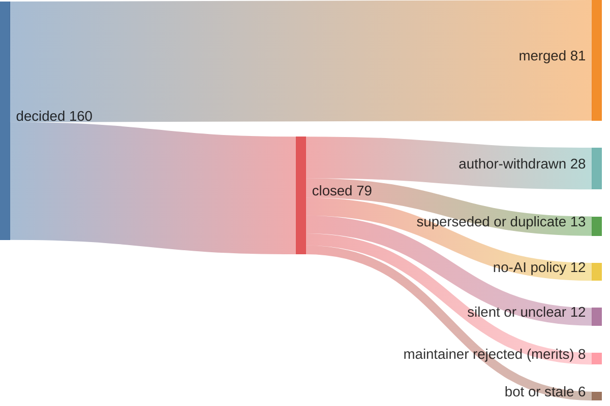

# Why closed PRs were closed (close-reason audit)

The headline "merge rate" counts a closed-unmerged PR as a negative. But "closed"
lumps together genuine maintainer rejections and closes that say nothing about the
change's quality — PRs the author withdrew, closes under a no-AI policy, duplicates
of work already done, and bot/stale auto-closes. This audit classifies every
closed-unmerged PR by *why* it closed, with verbatim evidence per PR in
[`closed-pr-reasons.jsonl`](closed-pr-reasons.jsonl). Full enumeration of all
merged + closed PRs is in [`pr-receipts.jsonl`](pr-receipts.jsonl).

Live GitHub counts (pipeline epoch 2026-05-09); reproduce with the GraphQL in
[`README.md`](README.md). The number moves as open PRs decide.

## Decided PRs by outcome

| close reason | n | counts as a quality verdict? |
|---|---:|---|
| author-withdrawn (author self-closed, mostly post-program) | 28 | no — no maintainer verdict |
| superseded or duplicate (already done / closed in favor of) | 13 | no — work redundant, not rejected on merit |
| no-AI policy (closed for AI provenance, not content) | 12 | no — adoption barrier, not a merit verdict |
| bot or stale (auto-closed by a bot / stale-bot) | 6 | no |
| silent or unclear (closed, no informative reason captured) | 12 | **ambiguous** — counted against us conservatively |
| maintainer rejected on merits | 8 | **yes** — the genuine negative |

## Merge rate under three denominators

Reported as a range, not a single number, because the right denominator depends on
the question. The raw rate leads; the merit-conditioned rates are context, not a
replacement.

| rate | definition | value |
|---|---|---:|
| raw merge rate | merged / (merged + all closed-unmerged) | 81 / 160 = **50.6%** |
| merit + ambiguous (conservative) | merged / (merged + maintainer-merit + silent/unclear) | 81 / 101 = **80.2%** |
| merit-only (optimistic) | merged / (merged + maintainer-merit) | 81 / 89 = **91.0%** |

When a maintainer actually adjudicated the change on its merits, it merged 80–91%
of the time. The raw 50.6% is held down by self-withdrawals, no-AI-policy closes,
duplicates, and bot closes — none of which are judgments that the work was wrong.

**Anti-laundering note.** Every reclassification is mechanically checkable, not
discretionary: `author-withdrawn` is `closed_by == author`; `bot/stale` is the
closing actor's account; `no-AI policy`, `superseded`, and `merits` cite a verbatim
closing comment in `closed-pr-reasons.jsonl`. Ambiguous closes are counted as
rejections, not excluded. The point is not to move the headline — it stays 50.6% —
but to show what the 79 closes are actually made of.

**Why the campaign ended (resource constraint, disclosed — not used to adjust the
denominator).** Work stopped in mid-May 2026 when the author lost access to the
Linux/Windows development environment the campaign ran on. PRs that needed
platform-specific follow-up to address maintainer feedback could not be iterated,
so some were withdrawn and others remain open. These are counted in the
denominator exactly as they stand — the open tail is not trimmed and the
withdrawals are not reclassified; this note explains the tail, it does not move the
number. With thanks to **Electronic Arts**, whose research-token compute and
development infrastructure supported this campaign; Electronic Arts did not
commission, direct, or review the work.
