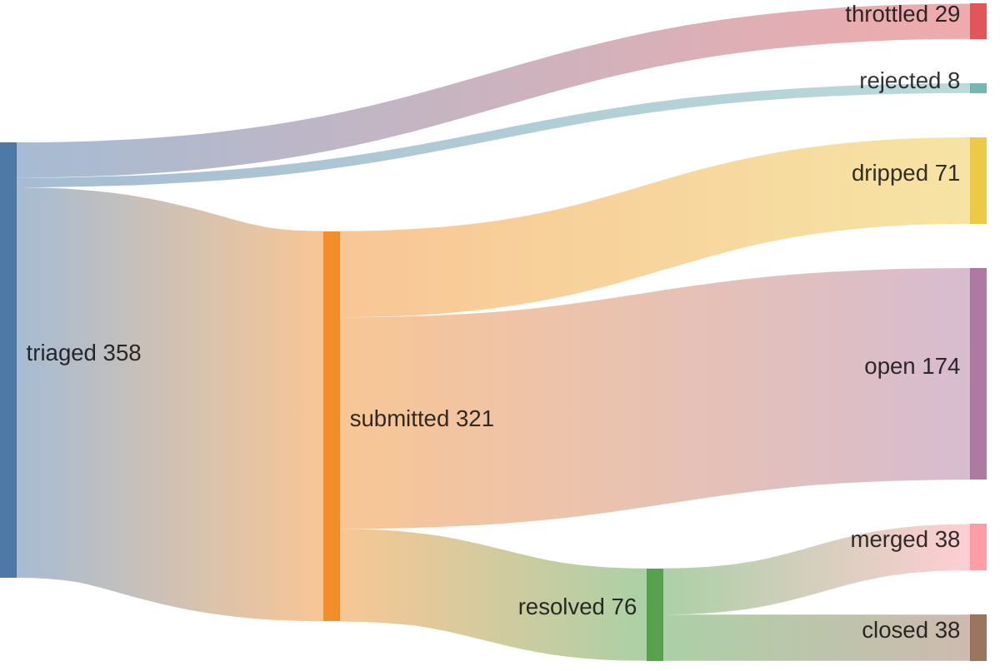
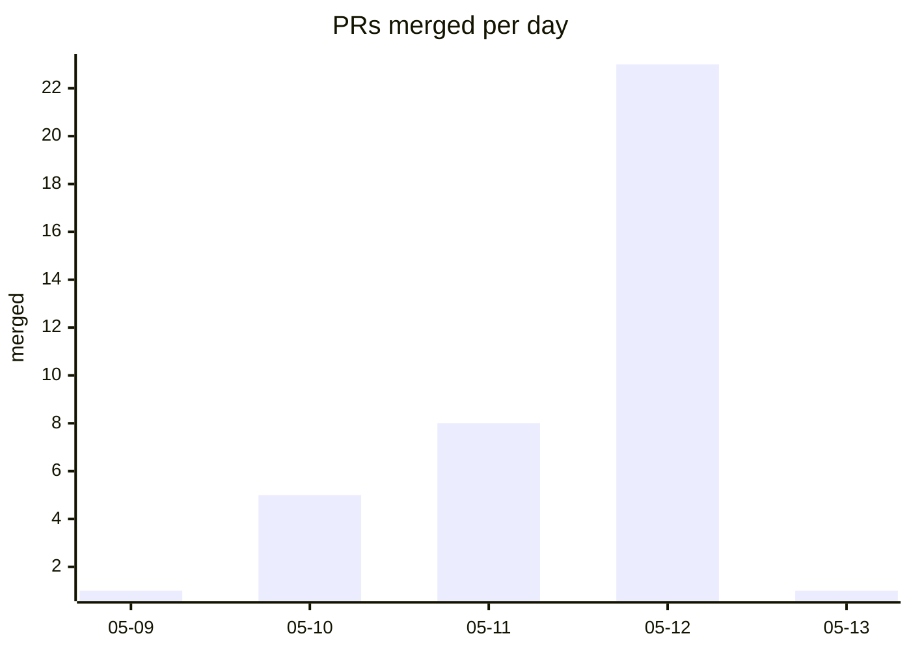

## 50% merge rate · 1 streak (01:59 UTC)

[Speedrunning Open Source](https://june.kim/speedrunning-open-source)





*since 2026-05-09T00:34:00Z (pipeline epoch)*

<details>
<summary>verify</summary>

```graphql
{ merged: search(query: "is:pr is:merged author:kimjune01 created:>2026-05-09T00:34:00Z", type: ISSUE) { issueCount }
  closed: search(query: "is:pr is:closed is:unmerged author:kimjune01 created:>2026-05-09T00:34:00Z", type: ISSUE) { issueCount } }
```

</details>

## Feed

| | repo | PR |
|---|------|----|
| ✅ | vavallee/bindery | [#622](https://github.com/vavallee/bindery/pull/622) feat(library): surface unmatched files in Set |
| ❌ | du82/nonograph | [#17](https://github.com/du82/nonograph/pull/17) Fix selection anchor restoration on page load |
| ✅ | sorairolake/qrtool | [#1002](https://github.com/sorairolake/qrtool/pull/1002) fix: return non-zero exit code when no QR cod |
| ✅ | VictoriaMetrics/VictoriaMetrics | [#10934](https://github.com/VictoriaMetrics/VictoriaMetrics/pull/10934) feat: add basicAuth.usernameFile CLI flags fo |
| ✅ | jetzig-framework/zmpl | [#71](https://github.com/jetzig-framework/zmpl/pull/71) Fix cross-platform compilation: use host targ |
| ✅ | pylint-dev/astroid | [#3053](https://github.com/pylint-dev/astroid/pull/3053) test: add Subscript target coverage for starr |
| ✅ | mgree/ffs | [#144](https://github.com/mgree/ffs/pull/144) Fix empty file mounting for JSON, YAML, and T |
| ✅ | godotengine/godot | [#119362](https://github.com/godotengine/godot/pull/119362) Fix dragging unselected items from FileSystem |
| ✅ | hyperium/hyper | [#4068](https://github.com/hyperium/hyper/pull/4068) feat(http2/client): expose reset_stream_durat |
| ✅ | pawurb/hotpath-rs | [#338](https://github.com/pawurb/hotpath-rs/pull/338) fix: Windows thread monitoring support |

## Leaderboard

*voluntary contributions to repos you don't own | non-owner only | [methodology](https://github.com/kimjune01/kimjune01)*

| contributor | merged | rate | repos |
|---|---|---|---|
| SAY-5 | 80 | 64% | 74 |
| kimjune01 | 29 | 55% | 26 |
| mvanhorn | 22 | 81% | 19 |
| ununununium | 13 | 68% | 11 |
| yakushabb | 12 | 80% | 12 |
| officialasishkumar | 9 | 81% | 7 |
| GeertvanHorrik | 1 | 50% | 1 |

[Join the leaderboard](https://github.com/kimjune01/sweep/blob/master/README.md) · [Protect your repo](https://github.com/kimjune01/sweep/blob/master/action.yml)

## AI SLOP

| PR | time to close | bugs | title |
|---|---|---|---|
| [uptime-kuma#7371](https://github.com/louislam/uptime-kuma/pull/7371) | <1 min | 0 | 🚨⚠️AI Slop⚠️🚨 cherry-picked |
| [uptime-kuma#7372](https://github.com/louislam/uptime-kuma/pull/7372) | <1 min | 0 | 🚨⚠️AI Slop⚠️🚨 cherry-picked |
| [litestar#4755](https://github.com/litestar-org/litestar/pull/4755) | 7 hrs | 0 | closed per AI policy |
| [ruff#25066](https://github.com/astral-sh/ruff/pull/25066) | 2 days | 0 | mainly produced by AI |
| [llama.cpp#22873](https://github.com/ggml-org/llama.cpp/pull/22873) | 2 days | 1 | AI-generated PR detected |

[hypothesis graph](HYPOTHESIS_GRAPH.md)

---

[june.kim](https://june.kim) · AGPL where it matters
