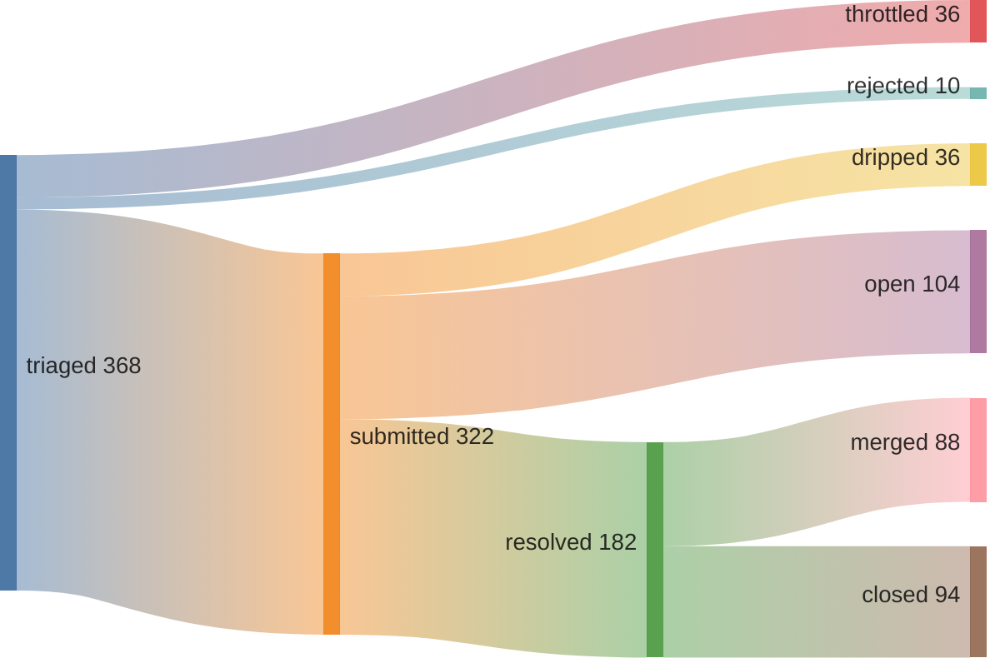
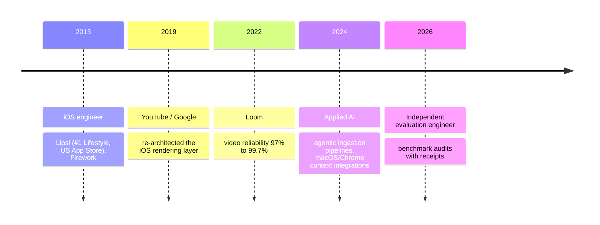

Evaluation engineer. I audit frontier coding benchmarks for construct validity, finding where the headline metric measures something other than what it claims. Every audit ships as a preregistered, re-runnable artifact with a public repo. This page links the receipts.

[june.kim](https://june.kim) · june@june.kim

## 🔬 Benchmark audits

| benchmark | finding | receipts |
|---|---|---|
| SWE-bench Pro | 15% of the 728 public tasks are underdetermined: the hidden tests grade behavior the spec never stated. 3 gold patches fail the benchmark's own verifier. | [audit](https://june.kim/a-determinacy-audit-of-swebench-pro) · [tool](https://github.com/kimjune01/determinacy) |
| SWE-bench Pro (run) | 95.3% (694/728) under the official grader, solo, mostly on a $200/month plan. Preregistered, frozen, every verdict re-gradable from a committed diff. | [repo](https://github.com/kimjune01/swebench-pro) · [field guide](https://june.kim/how-not-to-run-swebench-pro) |
| ProgramBench | "% Resolved" scores recall of published algorithms, not source-blind reconstruction. 21+ programs are gated on recalling a hash, cipher, or codec. | [paper](https://june.kim/programbench-measures-recall) · [repo](https://github.com/kimjune01/program-bench-audit) |
| Terminal-Bench | Grading is blind to destruction. A run can wreck everything outside the task frame and still pass. | [paper](https://june.kim/terminal-bench-frame) · [repo](https://github.com/kimjune01/terminal-bench-audit) |
| DeepSWE | 4 of 113 reference solutions fail their own verifiers. Found for under $1, in under an hour, with a preregistered two-pass protocol. | [v1](https://june.kim/auditing-deepswe) · [v1.1](https://june.kim/auditing-deepswe-v1-1) · [repo](https://github.com/kimjune01/deepswe-run) |
| SWE-bench Verified | 426/500 (85.2%), denominator reconciled instance by instance; the set is contamination-compromised. | [post](https://june.kim/swebench-verified) · [repo](https://github.com/kimjune01/swebench-verified) |
| SWE-rebench | Determinacy audit of the 2026_03 split: a 14.5% pointer-checkable claimable spine. | [repo](https://github.com/kimjune01/swe-rebench-audit) |

## 📜 Research

- [The Hypothesis Graph](https://june.kim/the-hypothesis-graph-semantic-memory-methodeutics), [Verifiable Knowledge](https://june.kim/verifiable-knowledge), and [What Cannot Be False Cannot Be True](https://june.kim/what-cannot-be-false-cannot-be-true): DOI-archived preprints with reproducible artifacts.
- [Speedrunning Open Source](https://june.kim/speedrunning-open-source): adversarial review loops push test-passing LLM code from 43% to 91% merge-readiness, deployed as real-maintainer PRs.
- Methodology in public: a preregistration checklist, published null results, and [a post-mortem of a $1,000 mistake](https://june.kim/how-not-to-run-swebench-pro) caused by held-out-test leakage.

## 🔧 Open source

*112 merged PRs across 90 repos I don't own*, in Rust, Go, C++, and Python: godot, hyper, envoy, servo, tidb, Enzyme, flux, wild, and 82 more. It's how I read a benchmark's test suite in whatever stack it ships.

Since the pipeline epoch (2026-05-09): *88 merged / 182 resolved, a 48% merge rate*, with 104 still open as of Jul 9, 2026.

<details>
<summary>the funnel, triage to merge · as of Jul 9, 2026</summary>



*Triage-side counts are frozen at campaign end (May 20); the submitted branch is live GitHub data, with dripped as the remainder.*


</details>

<details>
<summary>where the closed PRs went</summary>

Most closed PRs are self-withdrawals, no-AI policies, duplicates, or bot closes; the audit is in [why the closed PRs closed](CLOSE_REASONS.md), with machine-readable receipts in [`pr-receipts.jsonl`](pr-receipts.jsonl) and [`closed-pr-reasons.jsonl`](closed-pr-reasons.jsonl). A sibling campaign filed 65 issues offering repos a slop filter; 67% positive reception among maintainer-decided, tracked in a [hypothesis graph](https://github.com/kimjune01/sweep/blob/master/ISSUE_HYPOTHESIS_GRAPH.md) (as of May 20).

</details>

<details>
<summary>recent feed · ✅ merged, ❌ closed unmerged</summary>

| | repo | PR |
|---|---|---|
| ❌ | FyroxEngine/Fyrox | [#917](https://github.com/FyroxEngine/Fyrox/pull/917) Fix transmute_slice UB: add alignment, divisibility, and ZST guards |
| ✅ | akshettrj/watgbridge | [#85](https://github.com/akshettrj/watgbridge/pull/85) fix: apply ephemeral timer to @all and .id commands |
| ❌ | pola-rs/polars | [#27561](https://github.com/pola-rs/polars/pull/27561) fix(rust): Return correct Struct dtype from qcut on empty series |
| ❌ | feldera/feldera | [#6219](https://github.com/feldera/feldera/pull/6219) feat(pytest): add read_table() and log_files() to DeltaTestLocation |
| ❌ | open-webui/open-webui | [#24547](https://github.com/open-webui/open-webui/pull/24547) fix: llamacpp load/unload indicator now detects loaded models via /slots |
| ❌ | SWE-bench/experiments | [#448](https://github.com/SWE-bench/experiments/pull/448) Add Verified submission: recon-craft-audit (426/500, 85.2%) |
| ✅ | EnzymeAD/Enzyme | [#2899](https://github.com/EnzymeAD/Enzyme/pull/2899) [MLIR] fix: complex.create reverse mode flips imaginary-operand gradient sign |
| ❌ | oven-sh/bun | [#30430](https://github.com/oven-sh/bun/pull/30430) Fix per-stream ANSI color detection when stdout/stderr differ |

</details>

<details>
<summary>hall of ❌: PRs closed for being AI, with zero bugs found</summary>

| PR | time to close | bugs | title |
|---|---|---|---|
| [uptime-kuma#7371](https://github.com/louislam/uptime-kuma/pull/7371) | <1 min | 0 | 🚨⚠️AI Slop⚠️🚨 cherry-picked |
| [uptime-kuma#7372](https://github.com/louislam/uptime-kuma/pull/7372) | <1 min | 0 | 🚨⚠️AI Slop⚠️🚨 cherry-picked |
| [litestar#4755](https://github.com/litestar-org/litestar/pull/4755) | 7 hrs | 0 | closed per AI policy |
| [ruff#25066](https://github.com/astral-sh/ruff/pull/25066) | 2 days | 0 | mainly produced by AI |
| [llama.cpp#22873](https://github.com/ggml-org/llama.cpp/pull/22873) | 2 days | 1 | AI-generated PR detected |

[hypothesis graph](https://github.com/kimjune01/sweep/blob/master/HYPOTHESIS_GRAPH.md)

</details>

<details>
<summary>leaderboard · voluntary contributions to repos you don't own · as of Jul 9, 2026</summary>

| contributor | merged | rate | repos | median diff |
|---|---|---|---|---|
| mvanhorn | 715 | 66% | 404 | 80 |
| SAY-5 | 489 | 73% | 447 | 23 |
| fdelbrayelle | 329 | 91% | 169 | 1 |
| ununununium | 84 | 72% | 64 | 1 |
| kimjune01 | 70 | 50% | 63 | 45 |

*PRs created since 2026-05-09 to repos outside the author's account; rate = merged ÷ (merged + closed unmerged), median diff = added + deleted lines. The kimjune01 row is lower than the funnel above because the funnel includes own-account repos. yakushabb, on the May board with 24 merged, dropped off: the account no longer exists.*

[Join the leaderboard](https://github.com/kimjune01/sweep/blob/master/README.md) · [Protect your repo](https://github.com/kimjune01/sweep/blob/master/action.yml)

</details>

<details>
<summary>verify the numbers yourself</summary>

```graphql
{ merged: search(query: "is:pr is:merged author:kimjune01 created:>2026-05-09T00:34:00Z", type: ISSUE) { issueCount }
  closed: search(query: "is:pr is:closed is:unmerged author:kimjune01 created:>2026-05-09T00:34:00Z", type: ISSUE) { issueCount }
  allTime: search(query: "is:pr is:merged author:kimjune01 -user:kimjune01", type: ISSUE) { issueCount } }
```

</details>

## ⏳ Before this



---

[june.kim](https://june.kim) · [CC-BY-SA-NS](https://june.kim/cc-by-sa-ns)
