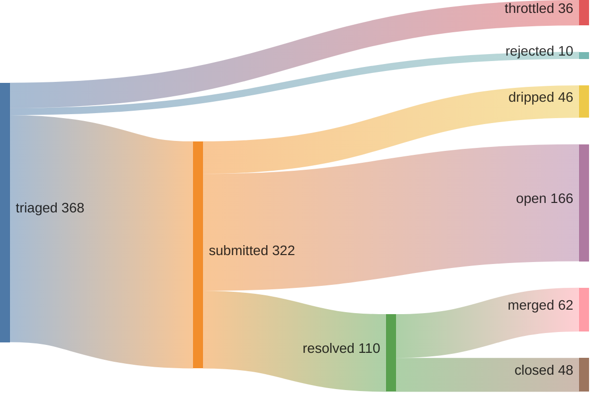
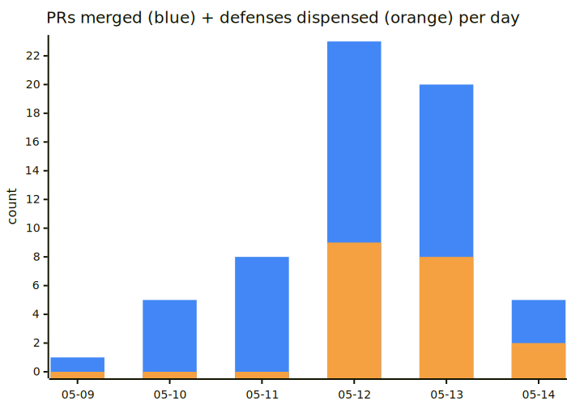
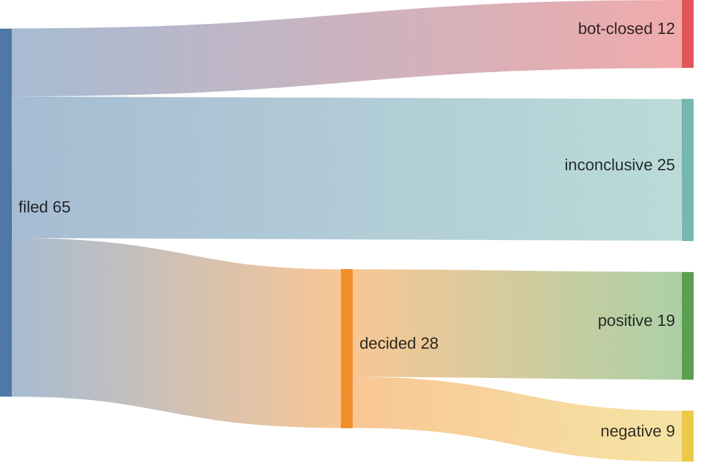

## 56% merge rate (as of May 14, 2026)

[Speedrunning Open Source](https://june.kim/speedrunning-open-source) · [how the loop works](https://june.kim/does-iteration-mitigate-slop-slope) (mechanism explainer; data is in the verify block below)





*since 2026-05-09T00:34:00Z (pipeline epoch)*

<details>
<summary>verify</summary>

```graphql
{ merged: search(query: "is:pr is:merged author:kimjune01 created:>2026-05-09T00:34:00Z", type: ISSUE) { issueCount }
  closed: search(query: "is:pr is:closed is:unmerged author:kimjune01 created:>2026-05-09T00:34:00Z", type: ISSUE) { issueCount } }
```

</details>

## Issues generated

**67% positive reception** · [hypothesis graph](https://github.com/kimjune01/sweep/blob/master/ISSUE_HYPOTHESIS_GRAPH.md)

65 issues filed since 2026-05-12 (slop-filter campaign start) · 19 positive · 9 negative · 12 bot-closed (already protected) · 25 inconclusive



*positive = closed-as-completed, accepted/bug-labeled, or open with maintainer engagement. negative = maintainer rejected (closed-as-not-planned with engagement), or silent treatment (open with no engagement after 7-day grace — wrong target). bot-closed = closed by a bot account, spam-labeled, or stale-bot patterns — these repos already have automated handling, so the offer is redundant. inconclusive = open without engagement within 7-day grace, or closed as duplicate. rate = positive ÷ (positive + negative).*

<details>
<summary>verify</summary>

```graphql
{ filed: search(query: "is:issue author:kimjune01 created:>2026-05-12", type: ISSUE) { issueCount }
  completed: search(query: "is:issue is:closed reason:completed author:kimjune01 created:>2026-05-12", type: ISSUE) { issueCount }
  not_planned: search(query: "is:issue is:closed reason:not-planned author:kimjune01 created:>2026-05-12", type: ISSUE) { issueCount } }
```

</details>

## Feed · 🔥 6 streak

| | repo | PR |
|---|------|----|
| ✅ | prowler-cloud/prowler | [#11094](https://github.com/prowler-cloud/prowler/pull/11094) feat(sagemaker): add sagemaker_domain_sso_con |
| ✅ | macbre/sql-metadata | [#630](https://github.com/macbre/sql-metadata/pull/630) Fix UNION column alias aggregation |
| ✅ | FyroxEngine/Fyrox | [#918](https://github.com/FyroxEngine/Fyrox/pull/918) Fix read_pixels_of_type UB: use bytemuck::cas |
| ✅ | chapmanjacobd/library | [#49](https://github.com/chapmanjacobd/library/pull/49) fix: correct boolean conversion in ArgparseDi |
| ✅ | mono0926/LicensePlist | [#256](https://github.com/mono0926/LicensePlist/pull/256) fix: resolve SourcePackages path for Xcode 26 |
| ✅ | cackle-rs/cackle | [#53](https://github.com/cackle-rs/cackle/pull/53) Fix build instruction suggestions to use wild |
| ❌ | Jaxx497/NoctaVox | [#21](https://github.com/Jaxx497/NoctaVox/pull/21) fix: provide actionable error messages for da |
| ✅ | ag2ai/ag2 | [#2805](https://github.com/ag2ai/ag2/pull/2805) fix: initialize task variable in RemoteAgent  |
| ✅ | hyperium/hyper | [#4065](https://github.com/hyperium/hyper/pull/4065) docs(error): add detailed doc comments to Err |
| ✅ | luminal-ai/luminal | [#312](https://github.com/luminal-ai/luminal/pull/312) feat: add CUDA 13.2 support via cudarc 0.19.4 |

## Leaderboard

*since 2026-05-09 (pipeline epoch) | voluntary contributions to repos you don't own | non-owner only | [methodology](https://github.com/kimjune01/kimjune01)*

| contributor | merged | rate | repos | median diff |
|---|---|---|---|---|
| SAY-5 | 127 | 70% | 48+ | 29 |
| kimjune01 | 49 | 60% | 46 | 41 |
| mvanhorn | 33 | 84% | 26 | 54 |
| yakushabb | 24 | 80% | 23 | 10 |
| ununununium | 15 | 71% | 12 | 1 |
| fdelbrayelle | 7 | 87% | 4 | 43 |

[Join the leaderboard](https://github.com/kimjune01/sweep/blob/master/README.md) · [Protect your repo](https://github.com/kimjune01/sweep/blob/master/action.yml)

## AI SLOP

| PR | time to close | bugs | title |
|---|---|---|---|
| [uptime-kuma#7371](https://github.com/louislam/uptime-kuma/pull/7371) | <1 min | 0 | 🚨⚠️AI Slop⚠️🚨 cherry-picked |
| [uptime-kuma#7372](https://github.com/louislam/uptime-kuma/pull/7372) | <1 min | 0 | 🚨⚠️AI Slop⚠️🚨 cherry-picked |
| [litestar#4755](https://github.com/litestar-org/litestar/pull/4755) | 7 hrs | 0 | closed per AI policy |
| [ruff#25066](https://github.com/astral-sh/ruff/pull/25066) | 2 days | 0 | mainly produced by AI |
| [llama.cpp#22873](https://github.com/ggml-org/llama.cpp/pull/22873) | 2 days | 1 | AI-generated PR detected |

[hypothesis graph](https://github.com/kimjune01/sweep/blob/master/HYPOTHESIS_GRAPH.md)

---

[june.kim](https://june.kim) · CC-BY-NA-NS
