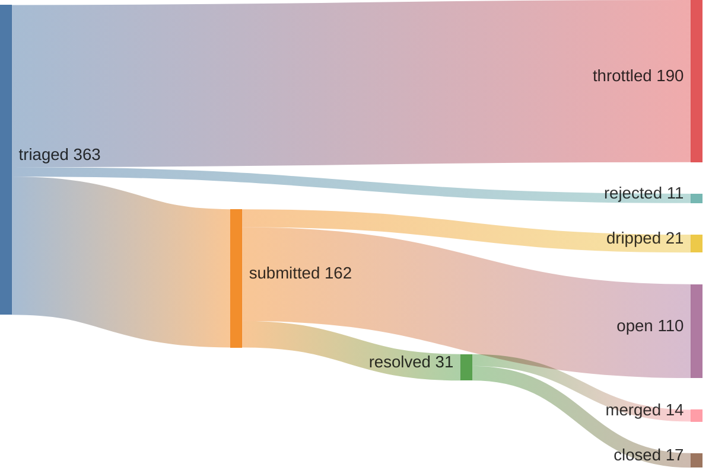

## 45% merge rate · 1 streak (01:59 UTC)



*since 2026-05-09T00:34:00Z (pipeline epoch)*

<details>
<summary>verify</summary>

```graphql
{ merged: search(query: "is:pr is:merged author:kimjune01 created:>2026-05-09T00:34:00Z", type: ISSUE) { issueCount }
  closed: search(query: "is:pr is:closed is:unmerged author:kimjune01 created:>2026-05-09T00:34:00Z", type: ISSUE) { issueCount } }
```

</details>

## Feed

| | repo | PR |
|---|------|----|
| ✅ | jmpsec/osctrl | [#807](https://github.com/jmpsec/osctrl/pull/807) Fix OSX quick-enroll: stop osqueryd before un |
| ❌ | ggml-org/llama.cpp | [#22873](https://github.com/ggml-org/llama.cpp/pull/22873) server : fix n_predict=-2 (generate until con |
| ❌ | dhonus/jellyfin-tui | [#192](https://github.com/dhonus/jellyfin-tui/pull/192) fix: reduce idle CPU usage with frame rate li |
| ✅ | scverse/pertpy | [#965](https://github.com/scverse/pertpy/pull/965) Fix plot_multicomparison_fc ValueError with d |
| ✅ | azerty9971/xtend_tuya | [#930](https://github.com/azerty9971/xtend_tuya/pull/930) Fix battery device class ambiguity for generi |
| ❌ | dapr/dapr | [#9924](https://github.com/dapr/dapr/pull/9924) refactor: simplify workflow concurrency confi |
| ✅ | apache/airflow | [#66686](https://github.com/apache/airflow/pull/66686) Fix FAB role deletion foreign key constraint  |
| ❌ | astral-sh/ruff | [#25066](https://github.com/astral-sh/ruff/pull/25066) [flake8-todos] Recognize Jira-style issue IDs |
| ✅ | antonmedv/fx | [#414](https://github.com/antonmedv/fx/pull/414) Fix file argument detection when stdin is /de |
| ✅ | GreptimeTeam/greptimedb | [#8092](https://github.com/GreptimeTeam/greptimedb/pull/8092) fix: remove unparsed [heartbeat] sections fro |

## 🚨⚠️AI Slop⚠️🚨

| PR | time to close | bugs | notes |
|---|---|---|---|
| [uptime-kuma#7371](https://github.com/louislam/uptime-kuma/pull/7371) | <1 min | 0 | cherry-picked |
| [uptime-kuma#7372](https://github.com/louislam/uptime-kuma/pull/7372) | <1 min | 0 | cherry-picked |
| [litestar#4755](https://github.com/litestar-org/litestar/pull/4755) | 7 hrs | 0 | 100% test coverage |
| [ruff#25066](https://github.com/astral-sh/ruff/pull/25066) | 2 days | 0 | lacked rationale |
| [llama.cpp#22873](https://github.com/ggml-org/llama.cpp/pull/22873) | 2 days | 1 | automated checker |

[hypothesis graph](HYPOTHESIS_GRAPH.md)

---

[june.kim](https://june.kim) · AGPL where it matters
