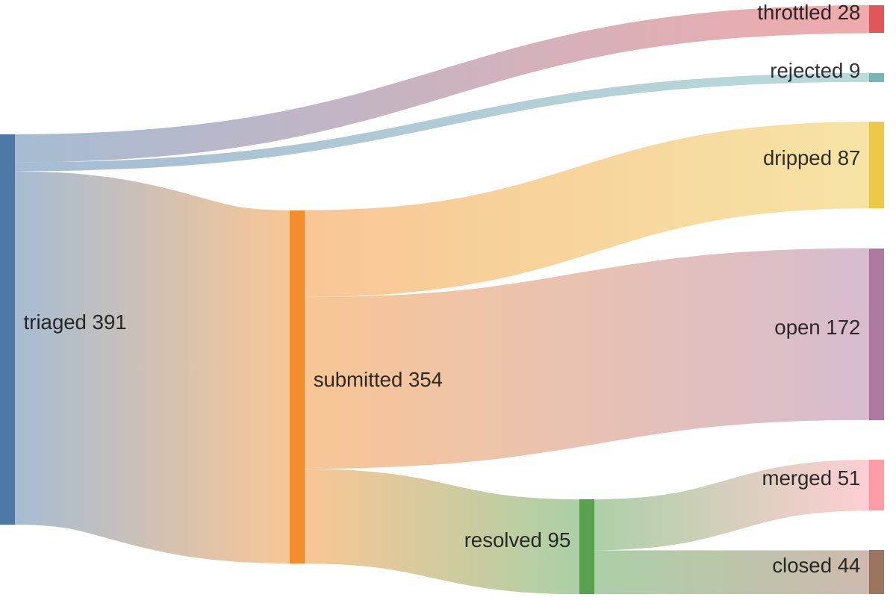
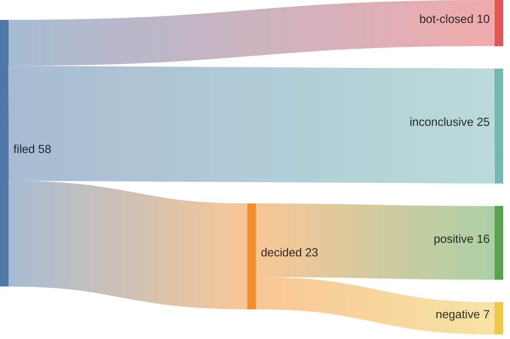

## 53% merge rate · 6 streak (15:56 UTC)

[Speedrunning Open Source](https://june.kim/speedrunning-open-source)



```mermaid
xychart-beta
    title "PRs merged + defenses dispensed per day"
    x-axis ["03-05", "03-06", "03-07", "03-08", "03-09", "03-10", "03-11", "03-12", "03-13", "03-14", "03-15", "03-16", "03-17", "03-18", "03-19", "03-20", "03-21", "03-22", "03-23", "03-24", "03-25", "03-26", "03-27", "03-28", "03-29", "03-30", "03-31", "04-01", "04-02", "04-03", "04-04", "04-05", "04-06", "04-07", "04-08", "04-09", "04-10", "04-11", "04-12", "04-13", "04-14", "04-15", "04-16", "04-17", "04-18", "04-19", "04-20", "04-21", "04-22", "04-23", "04-24", "04-25", "04-26", "04-27", "04-28", "04-29", "04-30", "05-01", "05-02", "05-03", "05-04", "05-05", "05-06", "05-07", "05-08", "05-09", "05-10", "05-11", "05-12", "05-13", "05-14", "05-15", "05-16", "05-17", "05-18", "05-19", "05-20", "05-21", "05-22", "05-23", "05-24", "05-25", "05-26", "05-27", "05-28", "05-29", "05-30", "05-31", "06-01", "06-02", "06-03", "06-04", "06-05", "06-06", "06-07", "06-08", "06-09", "06-10", "06-11", "06-12", "06-13", "06-14", "06-15", "06-16", "06-17", "06-18", "06-19", "06-20", "06-21", "06-22", "06-23", "06-24", "06-25", "06-26", "06-27", "06-28", "06-29", "06-30", "07-01", "07-02", "07-03", "07-04", "07-05", "07-06", "07-07", "07-08", "07-09", "07-10", "07-11", "07-12", "07-13", "07-14", "07-15", "07-16", "07-17", "07-18", "07-19", "07-20", "07-21", "07-22", "07-23", "07-24", "07-25", "07-26", "07-27", "07-28", "07-29", "07-30", "07-31", "08-01", "08-02", "08-03", "08-04", "08-05", "08-06", "08-07", "08-08", "08-09", "08-10", "08-11", "08-12", "08-13", "08-14", "08-15", "08-16", "08-17", "08-18", "08-19", "08-20", "08-21", "08-22", "08-23", "08-24", "08-25", "08-26", "08-27", "08-28", "08-29", "08-30", "08-31", "09-01", "09-02", "09-03", "09-04", "09-05", "09-06", "09-07", "09-08", "09-09", "09-10", "09-11", "09-12", "09-13", "09-14", "09-15", "09-16", "09-17", "09-18", "09-19", "09-20", "09-21", "09-22", "09-23", "09-24", "09-25", "09-26", "09-27", "09-28", "09-29", "09-30", "10-01", "10-02", "10-03", "10-04", "10-05", "10-06", "10-07", "10-08", "10-09", "10-10", "10-11", "10-12", "10-13", "10-14", "10-15", "10-16", "10-17", "10-18", "10-19", "10-20", "10-21", "10-22", "10-23", "10-24", "10-25", "10-26", "10-27", "10-28", "10-29", "10-30", "10-31", "11-01", "11-02", "11-03", "11-04", "11-05", "11-06", "11-07", "11-08", "11-09", "11-10", "11-11", "11-12", "11-13", "11-14", "11-15", "11-16", "11-17", "11-18", "11-19", "11-20", "11-21", "11-22", "11-23", "11-24", "11-25", "11-26", "11-27", "11-28", "11-29", "11-30", "12-01", "12-02", "12-03", "12-04", "12-05", "12-06", "12-07", "12-08", "12-09", "12-10", "12-11", "12-12", "12-13", "12-14", "12-15", "12-16", "12-17", "12-18", "12-19", "12-20", "12-21", "12-22", "12-23", "12-24", "12-25", "12-26", "12-27", "12-28", "12-29", "12-30", "12-31", "01-01", "01-02", "01-03", "01-04", "01-05", "01-06", "01-07", "01-08", "01-09", "01-10", "01-11", "01-12", "01-13", "01-14", "01-15", "01-16", "01-17", "01-18", "01-19", "01-20", "01-21", "01-22", "01-23", "01-24", "01-25", "01-26", "01-27", "01-28", "01-29", "01-30", "01-31", "02-01", "02-02", "02-03", "02-04", "02-05", "02-06", "02-07", "02-08", "02-09", "02-10", "02-11", "02-12", "02-13", "02-14", "02-15", "02-16", "02-17", "02-18", "02-19", "02-20", "02-21", "02-22", "02-23", "02-24", "02-25", "02-26", "02-27", "02-28", "02-29", "03-01", "03-02", "03-03", "03-04", "03-05", "03-06", "03-07", "03-08", "03-09", "03-10", "03-11", "03-12", "03-13", "03-14", "03-15", "03-16", "03-17", "03-18", "03-19", "03-20", "03-21", "03-22", "03-23", "03-24", "03-25", "03-26", "03-27", "03-28", "03-29", "03-30", "03-31", "04-01", "04-02", "04-03", "04-04", "04-05", "04-06", "04-07", "04-08", "04-09", "04-10", "04-11", "04-12", "04-13", "04-14", "04-15", "04-16", "04-17", "04-18", "04-19", "04-20", "04-21", "04-22", "04-23", "04-24", "04-25", "04-26", "04-27", "04-28", "04-29", "04-30", "05-01", "05-02", "05-03", "05-04", "05-05", "05-06", "05-07", "05-08", "05-09", "05-10", "05-11", "05-12", "05-13", "05-14", "05-15", "05-16", "05-17", "05-18", "05-19", "05-20", "05-21", "05-22", "05-23", "05-24", "05-25", "05-26", "05-27", "05-28", "05-29", "05-30", "05-31", "06-01", "06-02", "06-03", "06-04", "06-05", "06-06", "06-07", "06-08", "06-09", "06-10", "06-11", "06-12", "06-13", "06-14", "06-15", "06-16", "06-17", "06-18", "06-19", "06-20", "06-21", "06-22", "06-23", "06-24", "06-25", "06-26", "06-27", "06-28", "06-29", "06-30", "07-01", "07-02", "07-03", "07-04", "07-05", "07-06", "07-07", "07-08", "07-09", "07-10", "07-11", "07-12", "07-13", "07-14", "07-15", "07-16", "07-17", "07-18", "07-19", "07-20", "07-21", "07-22", "07-23", "07-24", "07-25", "07-26", "07-27", "07-28", "07-29", "07-30", "07-31", "08-01", "08-02", "08-03", "08-04", "08-05", "08-06", "08-07", "08-08", "08-09", "08-10", "08-11", "08-12", "08-13", "08-14", "08-15", "08-16", "08-17", "08-18", "08-19", "08-20", "08-21", "08-22", "08-23", "08-24", "08-25", "08-26", "08-27", "08-28", "08-29", "08-30", "08-31", "09-01", "09-02", "09-03", "09-04", "09-05", "09-06", "09-07", "09-08", "09-09", "09-10", "09-11", "09-12", "09-13", "09-14", "09-15", "09-16", "09-17", "09-18", "09-19", "09-20", "09-21", "09-22", "09-23", "09-24", "09-25", "09-26", "09-27", "09-28", "09-29", "09-30", "10-01", "10-02", "10-03", "10-04", "10-05", "10-06", "10-07", "10-08", "10-09", "10-10", "10-11", "10-12", "10-13", "10-14", "10-15", "10-16", "10-17", "10-18", "10-19", "10-20", "10-21", "10-22", "10-23", "10-24", "10-25", "10-26", "10-27", "10-28", "10-29", "10-30", "10-31", "11-01", "11-02", "11-03", "11-04", "11-05", "11-06", "11-07", "11-08", "11-09", "11-10", "11-11", "11-12", "11-13", "11-14", "11-15", "11-16", "11-17", "11-18", "11-19", "11-20", "11-21", "11-22", "11-23", "11-24", "11-25", "11-26", "11-27", "11-28", "11-29", "11-30", "12-01", "12-02", "12-03", "12-04", "12-05", "12-06", "12-07", "12-08", "12-09", "12-10", "12-11", "12-12", "12-13", "12-14", "12-15", "12-16", "12-17", "12-18", "12-19", "12-20", "12-21", "12-22", "12-23", "12-24", "12-25", "12-26", "12-27", "12-28", "12-29", "12-30", "12-31", "01-01", "01-02", "01-03", "01-04", "01-05", "01-06", "01-07", "01-08", "01-09", "01-10", "01-11", "01-12", "01-13", "01-14", "01-15", "01-16", "01-17", "01-18", "01-19", "01-20", "01-21", "01-22", "01-23", "01-24", "01-25", "01-26", "01-27", "01-28", "01-29", "01-30", "01-31", "02-01", "02-02", "02-03", "02-04", "02-05", "02-06", "02-07", "02-08", "02-09", "02-10", "02-11", "02-12", "02-13", "02-14", "02-15", "02-16", "02-17", "02-18", "02-19", "02-20", "02-21", "02-22", "02-23", "02-24", "02-25", "02-26", "02-27", "02-28", "03-01", "03-02", "03-03", "03-04", "03-05", "03-06", "03-07", "03-08", "03-09", "03-10", "03-11", "03-12", "03-13", "03-14", "03-15", "03-16", "03-17", "03-18", "03-19", "03-20", "03-21", "03-22", "03-23", "03-24", "03-25", "03-26", "03-27", "03-28", "03-29", "03-30", "03-31", "04-01", "04-02", "04-03", "04-04", "04-05", "04-06", "04-07", "04-08", "04-09", "04-10", "04-11", "04-12", "04-13", "04-14", "04-15", "04-16", "04-17", "04-18", "04-19", "04-20", "04-21", "04-22", "04-23", "04-24", "04-25", "04-26", "04-27", "04-28", "04-29", "04-30", "05-01", "05-02", "05-03", "05-04", "05-05", "05-06", "05-07", "05-08", "05-09", "05-10", "05-11", "05-12", "05-13", "05-14", "05-15", "05-16", "05-17", "05-18", "05-19", "05-20", "05-21", "05-22", "05-23", "05-24", "05-25", "05-26", "05-27", "05-28", "05-29", "05-30", "05-31", "06-01", "06-02", "06-03", "06-04", "06-05", "06-06", "06-07", "06-08", "06-09", "06-10", "06-11", "06-12", "06-13", "06-14", "06-15", "06-16", "06-17", "06-18", "06-19", "06-20", "06-21", "06-22", "06-23", "06-24", "06-25", "06-26", "06-27", "06-28", "06-29", "06-30", "07-01", "07-02", "07-03", "07-04", "07-05", "07-06", "07-07", "07-08", "07-09", "07-10", "07-11", "07-12", "07-13", "07-14", "07-15", "07-16", "07-17", "07-18", "07-19", "07-20", "07-21", "07-22", "07-23", "07-24", "07-25", "07-26", "07-27", "07-28", "07-29", "07-30", "07-31", "08-01", "08-02", "08-03", "08-04", "08-05", "08-06", "08-07", "08-08", "08-09", "08-10", "08-11", "08-12", "08-13", "08-14", "08-15", "08-16", "08-17", "08-18", "08-19", "08-20", "08-21", "08-22", "08-23", "08-24", "08-25", "08-26", "08-27", "08-28", "08-29", "08-30", "08-31", "09-01", "09-02", "09-03", "09-04", "09-05", "09-06", "09-07", "09-08", "09-09", "09-10", "09-11", "09-12", "09-13", "09-14", "09-15", "09-16", "09-17", "09-18", "09-19", "09-20", "09-21", "09-22", "09-23", "09-24", "09-25", "09-26", "09-27", "09-28", "09-29", "09-30", "10-01", "10-02", "10-03", "10-04", "10-05", "10-06", "10-07", "10-08", "10-09", "10-10", "10-11", "10-12", "10-13", "10-14", "10-15", "10-16", "10-17", "10-18", "10-19", "10-20", "10-21", "10-22", "10-23", "10-24", "10-25", "10-26", "10-27", "10-28", "10-29", "10-30", "10-31", "11-01", "11-02", "11-03", "11-04", "11-05", "11-06", "11-07", "11-08", "11-09", "11-10", "11-11", "11-12", "11-13", "11-14", "11-15", "11-16", "11-17", "11-18", "11-19", "11-20", "11-21", "11-22", "11-23", "11-24", "11-25", "11-26", "11-27", "11-28", "11-29", "11-30", "12-01", "12-02", "12-03", "12-04", "12-05", "12-06", "12-07", "12-08", "12-09", "12-10", "12-11", "12-12", "12-13", "12-14", "12-15", "12-16", "12-17", "12-18", "12-19", "12-20", "12-21", "12-22", "12-23", "12-24", "12-25", "12-26", "12-27", "12-28", "12-29", "12-30", "12-31", "01-01", "01-02", "01-03", "01-04", "01-05", "01-06", "01-07", "01-08", "01-09", "01-10", "01-11", "01-12", "01-13", "01-14", "01-15", "01-16", "01-17", "01-18", "01-19", "01-20", "01-21", "01-22", "01-23", "01-24", "01-25", "01-26", "01-27", "01-28", "01-29", "01-30", "01-31", "02-01", "02-02", "02-03", "02-04", "02-05", "02-06", "02-07", "02-08", "02-09", "02-10", "02-11", "02-12", "02-13", "02-14", "02-15", "02-16", "02-17", "02-18", "02-19", "02-20", "02-21", "02-22", "02-23", "02-24", "02-25", "02-26", "02-27", "02-28", "03-01", "03-02", "03-03", "03-04", "03-05", "03-06", "03-07", "03-08", "03-09", "03-10", "03-11", "03-12", "03-13", "03-14", "03-15", "03-16", "03-17", "03-18", "03-19", "03-20", "03-21", "03-22", "03-23", "03-24", "03-25", "03-26", "03-27", "03-28", "03-29", "03-30", "03-31", "04-01", "04-02", "04-03", "04-04", "04-05", "04-06", "04-07", "04-08", "04-09", "04-10", "04-11", "04-12", "04-13", "04-14", "04-15", "04-16", "04-17", "04-18", "04-19", "04-20", "04-21", "04-22", "04-23", "04-24", "04-25", "04-26", "04-27", "04-28", "04-29", "04-30", "05-01", "05-02", "05-03", "05-04", "05-05", "05-06", "05-07", "05-08", "05-09", "05-10", "05-11", "05-12", "05-13", "05-14", "05-15", "05-16", "05-17", "05-18", "05-19", "05-20", "05-21", "05-22", "05-23", "05-24", "05-25", "05-26", "05-27", "05-28", "05-29", "05-30", "05-31", "06-01", "06-02", "06-03", "06-04", "06-05", "06-06", "06-07", "06-08", "06-09", "06-10", "06-11", "06-12", "06-13", "06-14", "06-15", "06-16", "06-17", "06-18", "06-19", "06-20", "06-21", "06-22", "06-23", "06-24", "06-25", "06-26", "06-27", "06-28", "06-29", "06-30", "07-01", "07-02", "07-03", "07-04", "07-05", "07-06", "07-07", "07-08", "07-09", "07-10", "07-11", "07-12", "07-13", "07-14", "07-15", "07-16", "07-17", "07-18", "07-19", "07-20", "07-21", "07-22", "07-23", "07-24", "07-25", "07-26", "07-27", "07-28", "07-29", "07-30", "07-31", "08-01", "08-02", "08-03", "08-04", "08-05", "08-06", "08-07", "08-08", "08-09", "08-10", "08-11", "08-12", "08-13", "08-14", "08-15", "08-16", "08-17", "08-18", "08-19", "08-20", "08-21", "08-22", "08-23", "08-24", "08-25", "08-26", "08-27", "08-28", "08-29", "08-30", "08-31", "09-01", "09-02", "09-03", "09-04", "09-05", "09-06", "09-07", "09-08", "09-09", "09-10", "09-11", "09-12", "09-13", "09-14", "09-15", "09-16", "09-17", "09-18", "09-19", "09-20", "09-21", "09-22", "09-23", "09-24", "09-25", "09-26", "09-27", "09-28", "09-29", "09-30", "10-01", "10-02", "10-03", "10-04", "10-05", "10-06", "10-07", "10-08", "10-09", "10-10", "10-11", "10-12", "10-13", "10-14", "10-15", "10-16", "10-17", "10-18", "10-19", "10-20", "10-21", "10-22", "10-23", "10-24", "10-25", "10-26", "10-27", "10-28", "10-29", "10-30", "10-31", "11-01", "11-02", "11-03", "11-04", "11-05", "11-06", "11-07", "11-08", "11-09", "11-10", "11-11", "11-12", "11-13", "11-14", "11-15", "11-16", "11-17", "11-18", "11-19", "11-20", "11-21", "11-22", "11-23", "11-24", "11-25", "11-26", "11-27", "11-28", "11-29", "11-30", "12-01", "12-02", "12-03", "12-04", "12-05", "12-06", "12-07", "12-08", "12-09", "12-10", "12-11", "12-12", "12-13", "12-14", "12-15", "12-16", "12-17", "12-18", "12-19", "12-20", "12-21", "12-22", "12-23", "12-24", "12-25", "12-26", "12-27", "12-28", "12-29", "12-30", "12-31", "01-01", "01-02", "01-03", "01-04", "01-05", "01-06", "01-07", "01-08", "01-09", "01-10", "01-11", "01-12", "01-13", "01-14", "01-15", "01-16", "01-17", "01-18", "01-19", "01-20", "01-21", "01-22", "01-23", "01-24", "01-25", "01-26", "01-27", "01-28", "01-29", "01-30", "01-31", "02-01", "02-02", "02-03", "02-04", "02-05", "02-06", "02-07", "02-08", "02-09", "02-10", "02-11", "02-12", "02-13", "02-14", "02-15", "02-16", "02-17", "02-18", "02-19", "02-20", "02-21", "02-22", "02-23", "02-24", "02-25", "02-26", "02-27", "02-28", "03-01", "03-02", "03-03", "03-04", "03-05", "03-06", "03-07", "03-08", "03-09", "03-10", "03-11", "03-12", "03-13", "03-14", "03-15", "03-16", "03-17", "03-18", "03-19", "03-20", "03-21", "03-22", "03-23", "03-24", "03-25", "03-26", "03-27", "03-28", "03-29", "03-30", "03-31", "04-01", "04-02", "04-03", "04-04", "04-05", "04-06", "04-07", "04-08", "04-09", "04-10", "04-11", "04-12", "04-13", "04-14", "04-15", "04-16", "04-17", "04-18", "04-19", "04-20", "04-21", "04-22", "04-23", "04-24", "04-25", "04-26", "04-27", "04-28", "04-29", "04-30", "05-01", "05-02", "05-03", "05-04", "05-05", "05-06", "05-07", "05-08", "05-09", "05-10", "05-11", "05-12", "05-13", "05-14", "05-15", "05-16", "05-17", "05-18", "05-19", "05-20", "05-21", "05-22", "05-23", "05-24", "05-25", "05-26", "05-27", "05-28", "05-29", "05-30", "05-31", "06-01", "06-02", "06-03", "06-04", "06-05", "06-06", "06-07", "06-08", "06-09", "06-10", "06-11", "06-12", "06-13", "06-14", "06-15", "06-16", "06-17", "06-18", "06-19", "06-20", "06-21", "06-22", "06-23", "06-24", "06-25", "06-26", "06-27", "06-28", "06-29", "06-30", "07-01", "07-02", "07-03", "07-04", "07-05", "07-06", "07-07", "07-08", "07-09", "07-10", "07-11", "07-12", "07-13", "07-14", "07-15", "07-16", "07-17", "07-18", "07-19", "07-20", "07-21", "07-22", "07-23", "07-24", "07-25", "07-26", "07-27", "07-28", "07-29", "07-30", "07-31", "08-01", "08-02", "08-03", "08-04", "08-05", "08-06", "08-07", "08-08", "08-09", "08-10", "08-11", "08-12", "08-13", "08-14", "08-15", "08-16", "08-17", "08-18", "08-19", "08-20", "08-21", "08-22", "08-23", "08-24", "08-25", "08-26", "08-27", "08-28", "08-29", "08-30", "08-31", "09-01", "09-02", "09-03", "09-04", "09-05", "09-06", "09-07", "09-08", "09-09", "09-10", "09-11", "09-12", "09-13", "09-14", "09-15", "09-16", "09-17", "09-18", "09-19", "09-20", "09-21", "09-22", "09-23", "09-24", "09-25", "09-26", "09-27", "09-28", "09-29", "09-30", "10-01", "10-02", "10-03", "10-04", "10-05", "10-06", "10-07", "10-08", "10-09", "10-10", "10-11", "10-12", "10-13", "10-14", "10-15", "10-16", "10-17", "10-18", "10-19", "10-20", "10-21", "10-22", "10-23", "10-24", "10-25", "10-26", "10-27", "10-28", "10-29", "10-30", "10-31", "11-01", "11-02", "11-03", "11-04", "11-05", "11-06", "11-07", "11-08", "11-09", "11-10", "11-11", "11-12", "11-13", "11-14", "11-15", "11-16", "11-17", "11-18", "11-19", "11-20", "11-21", "11-22", "11-23", "11-24", "11-25", "11-26", "11-27", "11-28", "11-29", "11-30", "12-01", "12-02", "12-03", "12-04", "12-05", "12-06", "12-07", "12-08", "12-09", "12-10", "12-11", "12-12", "12-13", "12-14", "12-15", "12-16", "12-17", "12-18", "12-19", "12-20", "12-21", "12-22", "12-23", "12-24", "12-25", "12-26", "12-27", "12-28", "12-29", "12-30", "12-31", "01-01", "01-02", "01-03", "01-04", "01-05", "01-06", "01-07", "01-08", "01-09", "01-10", "01-11", "01-12", "01-13", "01-14", "01-15", "01-16", "01-17", "01-18", "01-19", "01-20", "01-21", "01-22", "01-23", "01-24", "01-25", "01-26", "01-27", "01-28", "01-29", "01-30", "01-31", "02-01", "02-02", "02-03", "02-04", "02-05", "02-06", "02-07", "02-08", "02-09", "02-10", "02-11", "02-12", "02-13", "02-14", "02-15", "02-16", "02-17", "02-18", "02-19", "02-20", "02-21", "02-22", "02-23", "02-24", "02-25", "02-26", "02-27", "02-28", "02-29", "03-01", "03-02", "03-03", "03-04", "03-05", "03-06", "03-07", "03-08", "03-09", "03-10", "03-11", "03-12", "03-13", "03-14", "03-15", "03-16", "03-17", "03-18", "03-19", "03-20", "03-21", "03-22", "03-23", "03-24", "03-25", "03-26", "03-27", "03-28", "03-29", "03-30", "03-31", "04-01", "04-02", "04-03", "04-04", "04-05", "04-06", "04-07", "04-08", "04-09", "04-10", "04-11", "04-12", "04-13", "04-14", "04-15", "04-16", "04-17", "04-18", "04-19", "04-20", "04-21", "04-22", "04-23", "04-24", "04-25", "04-26", "04-27", "04-28", "04-29", "04-30", "05-01", "05-02", "05-03", "05-04", "05-05", "05-06", "05-07", "05-08", "05-09", "05-10", "05-11", "05-12", "05-13", "05-14", "05-15", "05-16", "05-17", "05-18", "05-19", "05-20", "05-21", "05-22", "05-23", "05-24", "05-25", "05-26", "05-27", "05-28", "05-29", "05-30", "05-31", "06-01", "06-02", "06-03", "06-04", "06-05", "06-06", "06-07", "06-08", "06-09", "06-10", "06-11", "06-12", "06-13", "06-14", "06-15", "06-16", "06-17", "06-18", "06-19", "06-20", "06-21", "06-22", "06-23", "06-24", "06-25", "06-26", "06-27", "06-28", "06-29", "06-30", "07-01", "07-02", "07-03", "07-04", "07-05", "07-06", "07-07", "07-08", "07-09", "07-10", "07-11", "07-12", "07-13", "07-14", "07-15", "07-16", "07-17", "07-18", "07-19", "07-20", "07-21", "07-22", "07-23", "07-24", "07-25", "07-26", "07-27", "07-28", "07-29", "07-30", "07-31", "08-01", "08-02", "08-03", "08-04", "08-05", "08-06", "08-07", "08-08", "08-09", "08-10", "08-11", "08-12", "08-13", "08-14", "08-15", "08-16", "08-17", "08-18", "08-19", "08-20", "08-21", "08-22", "08-23", "08-24", "08-25", "08-26", "08-27", "08-28", "08-29", "08-30", "08-31", "09-01", "09-02", "09-03", "09-04", "09-05", "09-06", "09-07", "09-08", "09-09", "09-10", "09-11", "09-12", "09-13", "09-14", "09-15", "09-16", "09-17", "09-18", "09-19", "09-20", "09-21", "09-22", "09-23", "09-24", "09-25", "09-26", "09-27", "09-28", "09-29", "09-30", "10-01", "10-02", "10-03", "10-04", "10-05", "10-06", "10-07", "10-08", "10-09", "10-10", "10-11", "10-12", "10-13", "10-14", "10-15", "10-16", "10-17", "10-18", "10-19", "10-20", "10-21", "10-22", "10-23", "10-24", "10-25", "10-26", "10-27", "10-28", "10-29", "10-30", "10-31", "11-01", "11-02", "11-03", "11-04", "11-05", "11-06", "11-07", "11-08", "11-09", "11-10", "11-11", "11-12", "11-13", "11-14", "11-15", "11-16", "11-17", "11-18", "11-19", "11-20", "11-21", "11-22", "11-23", "11-24", "11-25", "11-26", "11-27", "11-28", "11-29", "11-30", "12-01", "12-02", "12-03", "12-04", "12-05", "12-06", "12-07", "12-08", "12-09", "12-10", "12-11", "12-12", "12-13", "12-14", "12-15", "12-16", "12-17", "12-18", "12-19", "12-20", "12-21", "12-22", "12-23", "12-24", "12-25", "12-26", "12-27", "12-28", "12-29", "12-30", "12-31", "01-01", "01-02", "01-03", "01-04", "01-05", "01-06", "01-07", "01-08", "01-09", "01-10", "01-11", "01-12", "01-13", "01-14", "01-15", "01-16", "01-17", "01-18", "01-19", "01-20", "01-21", "01-22", "01-23", "01-24", "01-25", "01-26", "01-27", "01-28", "01-29", "01-30", "01-31", "02-01", "02-02", "02-03", "02-04", "02-05", "02-06", "02-07", "02-08", "02-09", "02-10", "02-11", "02-12", "02-13", "02-14", "02-15", "02-16", "02-17", "02-18", "02-19", "02-20", "02-21", "02-22", "02-23", "02-24", "02-25", "02-26", "02-27", "02-28", "03-01", "03-02", "03-03", "03-04", "03-05", "03-06", "03-07", "03-08", "03-09", "03-10", "03-11", "03-12", "03-13", "03-14", "03-15", "03-16", "03-17", "03-18", "03-19", "03-20", "03-21", "03-22", "03-23", "03-24", "03-25", "03-26", "03-27", "03-28", "03-29", "03-30", "03-31", "04-01", "04-02", "04-03", "04-04", "04-05", "04-06", "04-07", "04-08", "04-09", "04-10", "04-11", "04-12", "04-13", "04-14", "04-15", "04-16", "04-17", "04-18", "04-19", "04-20", "04-21", "04-22", "04-23", "04-24", "04-25", "04-26", "04-27", "04-28", "04-29", "04-30", "05-01", "05-02", "05-03", "05-04", "05-05", "05-06", "05-07", "05-08", "05-09", "05-10", "05-11", "05-12", "05-13", "05-14", "05-15", "05-16", "05-17", "05-18", "05-19", "05-20", "05-21", "05-22", "05-23", "05-24", "05-25", "05-26", "05-27", "05-28", "05-29", "05-30", "05-31", "06-01", "06-02", "06-03", "06-04", "06-05", "06-06", "06-07", "06-08", "06-09", "06-10", "06-11", "06-12", "06-13", "06-14", "06-15", "06-16", "06-17", "06-18", "06-19", "06-20", "06-21", "06-22", "06-23", "06-24", "06-25", "06-26", "06-27", "06-28", "06-29", "06-30", "07-01", "07-02", "07-03", "07-04", "07-05", "07-06", "07-07", "07-08", "07-09", "07-10", "07-11", "07-12", "07-13", "07-14", "07-15", "07-16", "07-17", "07-18", "07-19", "07-20", "07-21", "07-22", "07-23", "07-24", "07-25", "07-26", "07-27", "07-28", "07-29", "07-30", "07-31", "08-01", "08-02", "08-03", "08-04", "08-05", "08-06", "08-07", "08-08", "08-09", "08-10", "08-11", "08-12", "08-13", "08-14", "08-15", "08-16", "08-17", "08-18", "08-19", "08-20", "08-21", "08-22", "08-23", "08-24", "08-25", "08-26", "08-27", "08-28", "08-29", "08-30", "08-31", "09-01", "09-02", "09-03", "09-04", "09-05", "09-06", "09-07", "09-08", "09-09", "09-10", "09-11", "09-12", "09-13", "09-14", "09-15", "09-16", "09-17", "09-18", "09-19", "09-20", "09-21", "09-22", "09-23", "09-24", "09-25", "09-26", "09-27", "09-28", "09-29", "09-30", "10-01", "10-02", "10-03", "10-04", "10-05", "10-06", "10-07", "10-08", "10-09", "10-10", "10-11", "10-12", "10-13", "10-14", "10-15", "10-16", "10-17", "10-18", "10-19", "10-20", "10-21", "10-22", "10-23", "10-24", "10-25", "10-26", "10-27", "10-28", "10-29", "10-30", "10-31", "11-01", "11-02", "11-03", "11-04", "11-05", "11-06", "11-07", "11-08", "11-09", "11-10", "11-11", "11-12", "11-13", "11-14", "11-15", "11-16", "11-17", "11-18", "11-19", "11-20", "11-21", "11-22", "11-23", "11-24", "11-25", "11-26", "11-27", "11-28", "11-29", "11-30", "12-01", "12-02", "12-03", "12-04", "12-05", "12-06", "12-07", "12-08", "12-09", "12-10", "12-11", "12-12", "12-13", "12-14", "12-15", "12-16", "12-17", "12-18", "12-19", "12-20", "12-21", "12-22", "12-23", "12-24", "12-25", "12-26", "12-27", "12-28", "12-29", "12-30", "12-31", "01-01", "01-02", "01-03", "01-04", "01-05", "01-06", "01-07", "01-08", "01-09", "01-10", "01-11", "01-12", "01-13", "01-14", "01-15", "01-16", "01-17", "01-18", "01-19", "01-20", "01-21", "01-22", "01-23", "01-24", "01-25", "01-26", "01-27", "01-28", "01-29", "01-30", "01-31", "02-01", "02-02", "02-03", "02-04", "02-05", "02-06", "02-07", "02-08", "02-09", "02-10", "02-11", "02-12", "02-13", "02-14", "02-15", "02-16", "02-17", "02-18", "02-19", "02-20", "02-21", "02-22", "02-23", "02-24", "02-25", "02-26", "02-27", "02-28", "03-01", "03-02", "03-03", "03-04", "03-05", "03-06", "03-07", "03-08", "03-09", "03-10", "03-11", "03-12", "03-13", "03-14", "03-15", "03-16", "03-17", "03-18", "03-19", "03-20", "03-21", "03-22", "03-23", "03-24", "03-25", "03-26", "03-27", "03-28", "03-29", "03-30", "03-31", "04-01", "04-02", "04-03", "04-04", "04-05", "04-06", "04-07", "04-08", "04-09", "04-10", "04-11", "04-12", "04-13", "04-14", "04-15", "04-16", "04-17", "04-18", "04-19", "04-20", "04-21", "04-22", "04-23", "04-24", "04-25", "04-26", "04-27", "04-28", "04-29", "04-30", "05-01", "05-02", "05-03", "05-04", "05-05", "05-06", "05-07", "05-08", "05-09", "05-10", "05-11", "05-12", "05-13", "05-14", "05-15", "05-16", "05-17", "05-18", "05-19", "05-20", "05-21", "05-22", "05-23", "05-24", "05-25", "05-26", "05-27", "05-28", "05-29", "05-30", "05-31", "06-01", "06-02", "06-03", "06-04", "06-05", "06-06", "06-07", "06-08", "06-09", "06-10", "06-11", "06-12", "06-13", "06-14", "06-15", "06-16", "06-17", "06-18", "06-19", "06-20", "06-21", "06-22", "06-23", "06-24", "06-25", "06-26", "06-27", "06-28", "06-29", "06-30", "07-01", "07-02", "07-03", "07-04", "07-05", "07-06", "07-07", "07-08", "07-09", "07-10", "07-11", "07-12", "07-13", "07-14", "07-15", "07-16", "07-17", "07-18", "07-19", "07-20", "07-21", "07-22", "07-23", "07-24", "07-25", "07-26", "07-27", "07-28", "07-29", "07-30", "07-31", "08-01", "08-02", "08-03", "08-04", "08-05", "08-06", "08-07", "08-08", "08-09", "08-10", "08-11", "08-12", "08-13", "08-14", "08-15", "08-16", "08-17", "08-18", "08-19", "08-20", "08-21", "08-22", "08-23", "08-24", "08-25", "08-26", "08-27", "08-28", "08-29", "08-30", "08-31", "09-01", "09-02", "09-03", "09-04", "09-05", "09-06", "09-07", "09-08", "09-09", "09-10", "09-11", "09-12", "09-13", "09-14", "09-15", "09-16", "09-17", "09-18", "09-19", "09-20", "09-21", "09-22", "09-23", "09-24", "09-25", "09-26", "09-27", "09-28", "09-29", "09-30", "10-01", "10-02", "10-03", "10-04", "10-05", "10-06", "10-07", "10-08", "10-09", "10-10", "10-11", "10-12", "10-13", "10-14", "10-15", "10-16", "10-17", "10-18", "10-19", "10-20", "10-21", "10-22", "10-23", "10-24", "10-25", "10-26", "10-27", "10-28", "10-29", "10-30", "10-31", "11-01", "11-02", "11-03", "11-04", "11-05", "11-06", "11-07", "11-08", "11-09", "11-10", "11-11", "11-12", "11-13", "11-14", "11-15", "11-16", "11-17", "11-18", "11-19", "11-20", "11-21", "11-22", "11-23", "11-24", "11-25", "11-26", "11-27", "11-28", "11-29", "11-30", "12-01", "12-02", "12-03", "12-04", "12-05", "12-06", "12-07", "12-08", "12-09", "12-10", "12-11", "12-12", "12-13", "12-14", "12-15", "12-16", "12-17", "12-18", "12-19", "12-20", "12-21", "12-22", "12-23", "12-24", "12-25", "12-26", "12-27", "12-28", "12-29", "12-30", "12-31", "01-01", "01-02", "01-03", "01-04", "01-05", "01-06", "01-07", "01-08", "01-09", "01-10", "01-11", "01-12", "01-13", "01-14", "01-15", "01-16", "01-17", "01-18", "01-19", "01-20", "01-21", "01-22", "01-23", "01-24", "01-25", "01-26", "01-27", "01-28", "01-29", "01-30", "01-31", "02-01", "02-02", "02-03", "02-04", "02-05", "02-06", "02-07", "02-08", "02-09", "02-10", "02-11", "02-12", "02-13", "02-14", "02-15", "02-16", "02-17", "02-18", "02-19", "02-20", "02-21", "02-22", "02-23", "02-24", "02-25", "02-26", "02-27", "02-28", "03-01", "03-02", "03-03", "03-04", "03-05", "03-06", "03-07", "03-08", "03-09", "03-10", "03-11", "03-12", "03-13", "03-14", "03-15", "03-16", "03-17", "03-18", "03-19", "03-20", "03-21", "03-22", "03-23", "03-24", "03-25", "03-26", "03-27", "03-28", "03-29", "03-30", "03-31", "04-01", "04-02", "04-03", "04-04", "04-05", "04-06", "04-07", "04-08", "04-09", "04-10", "04-11", "04-12", "04-13", "04-14", "04-15", "04-16", "04-17", "04-18", "04-19", "04-20", "04-21", "04-22", "04-23", "04-24", "04-25", "04-26", "04-27", "04-28", "04-29", "04-30", "05-01", "05-02", "05-03", "05-04", "05-05", "05-06", "05-07", "05-08", "05-09", "05-10", "05-11", "05-12", "05-13", "05-14", "05-15", "05-16", "05-17", "05-18", "05-19", "05-20", "05-21", "05-22", "05-23", "05-24", "05-25", "05-26", "05-27", "05-28", "05-29", "05-30", "05-31", "06-01", "06-02", "06-03", "06-04", "06-05", "06-06", "06-07", "06-08", "06-09", "06-10", "06-11", "06-12", "06-13", "06-14", "06-15", "06-16", "06-17", "06-18", "06-19", "06-20", "06-21", "06-22", "06-23", "06-24", "06-25", "06-26", "06-27", "06-28", "06-29", "06-30", "07-01", "07-02", "07-03", "07-04", "07-05", "07-06", "07-07", "07-08", "07-09", "07-10", "07-11", "07-12", "07-13", "07-14", "07-15", "07-16", "07-17", "07-18", "07-19", "07-20", "07-21", "07-22", "07-23", "07-24", "07-25", "07-26", "07-27", "07-28", "07-29", "07-30", "07-31", "08-01", "08-02", "08-03", "08-04", "08-05", "08-06", "08-07", "08-08", "08-09", "08-10", "08-11", "08-12", "08-13", "08-14", "08-15", "08-16", "08-17", "08-18", "08-19", "08-20", "08-21", "08-22", "08-23", "08-24", "08-25", "08-26", "08-27", "08-28", "08-29", "08-30", "08-31", "09-01", "09-02", "09-03", "09-04", "09-05", "09-06", "09-07", "09-08", "09-09", "09-10", "09-11", "09-12", "09-13", "09-14", "09-15", "09-16", "09-17", "09-18", "09-19", "09-20", "09-21", "09-22", "09-23", "09-24", "09-25", "09-26", "09-27", "09-28", "09-29", "09-30", "10-01", "10-02", "10-03", "10-04", "10-05", "10-06", "10-07", "10-08", "10-09", "10-10", "10-11", "10-12", "10-13", "10-14", "10-15", "10-16", "10-17", "10-18", "10-19", "10-20", "10-21", "10-22", "10-23", "10-24", "10-25", "10-26", "10-27", "10-28", "10-29", "10-30", "10-31", "11-01", "11-02", "11-03", "11-04", "11-05", "11-06", "11-07", "11-08", "11-09", "11-10", "11-11", "11-12", "11-13", "11-14", "11-15", "11-16", "11-17", "11-18", "11-19", "11-20", "11-21", "11-22", "11-23", "11-24", "11-25", "11-26", "11-27", "11-28", "11-29", "11-30", "12-01", "12-02", "12-03", "12-04", "12-05", "12-06", "12-07", "12-08", "12-09", "12-10", "12-11", "12-12", "12-13", "12-14", "12-15", "12-16", "12-17", "12-18", "12-19", "12-20", "12-21", "12-22", "12-23", "12-24", "12-25", "12-26", "12-27", "12-28", "12-29", "12-30", "12-31", "01-01", "01-02", "01-03", "01-04", "01-05", "01-06", "01-07", "01-08", "01-09", "01-10", "01-11", "01-12", "01-13", "01-14", "01-15", "01-16", "01-17", "01-18", "01-19", "01-20", "01-21", "01-22", "01-23", "01-24", "01-25", "01-26", "01-27", "01-28", "01-29", "01-30", "01-31", "02-01", "02-02", "02-03", "02-04", "02-05", "02-06", "02-07", "02-08", "02-09", "02-10", "02-11", "02-12", "02-13", "02-14", "02-15", "02-16", "02-17", "02-18", "02-19", "02-20", "02-21", "02-22", "02-23", "02-24", "02-25", "02-26", "02-27", "02-28", "02-29", "03-01", "03-02", "03-03", "03-04", "03-05", "03-06", "03-07", "03-08", "03-09", "03-10", "03-11", "03-12", "03-13", "03-14", "03-15", "03-16", "03-17", "03-18", "03-19", "03-20", "03-21", "03-22", "03-23", "03-24", "03-25", "03-26", "03-27", "03-28", "03-29", "03-30", "03-31", "04-01", "04-02", "04-03", "04-04", "04-05", "04-06", "04-07", "04-08", "04-09", "04-10", "04-11", "04-12", "04-13", "04-14", "04-15", "04-16", "04-17", "04-18", "04-19", "04-20", "04-21", "04-22", "04-23", "04-24", "04-25", "04-26", "04-27", "04-28", "04-29", "04-30", "05-01", "05-02", "05-03", "05-04", "05-05", "05-06", "05-07", "05-08", "05-09", "05-10", "05-11", "05-12", "05-13", "05-14", "05-15", "05-16", "05-17", "05-18", "05-19", "05-20", "05-21", "05-22", "05-23", "05-24", "05-25", "05-26", "05-27", "05-28", "05-29", "05-30", "05-31", "06-01", "06-02", "06-03", "06-04", "06-05", "06-06", "06-07", "06-08", "06-09", "06-10", "06-11", "06-12", "06-13", "06-14", "06-15", "06-16", "06-17", "06-18", "06-19", "06-20", "06-21", "06-22", "06-23", "06-24", "06-25", "06-26", "06-27", "06-28", "06-29", "06-30", "07-01", "07-02", "07-03", "07-04", "07-05", "07-06", "07-07", "07-08", "07-09", "07-10", "07-11", "07-12", "07-13", "07-14", "07-15", "07-16", "07-17", "07-18", "07-19", "07-20", "07-21", "07-22", "07-23", "07-24", "07-25", "07-26", "07-27", "07-28", "07-29", "07-30", "07-31", "08-01", "08-02", "08-03", "08-04", "08-05", "08-06", "08-07", "08-08", "08-09", "08-10", "08-11", "08-12", "08-13", "08-14", "08-15", "08-16", "08-17", "08-18", "08-19", "08-20", "08-21", "08-22", "08-23", "08-24", "08-25", "08-26", "08-27", "08-28", "08-29", "08-30", "08-31", "09-01", "09-02", "09-03", "09-04", "09-05", "09-06", "09-07", "09-08", "09-09", "09-10", "09-11", "09-12", "09-13", "09-14", "09-15", "09-16", "09-17", "09-18", "09-19", "09-20", "09-21", "09-22", "09-23", "09-24", "09-25", "09-26", "09-27", "09-28", "09-29", "09-30", "10-01", "10-02", "10-03", "10-04", "10-05", "10-06", "10-07", "10-08", "10-09", "10-10", "10-11", "10-12", "10-13", "10-14", "10-15", "10-16", "10-17", "10-18", "10-19", "10-20", "10-21", "10-22", "10-23", "10-24", "10-25", "10-26", "10-27", "10-28", "10-29", "10-30", "10-31", "11-01", "11-02", "11-03", "11-04", "11-05", "11-06", "11-07", "11-08", "11-09", "11-10", "11-11", "11-12", "11-13", "11-14", "11-15", "11-16", "11-17", "11-18", "11-19", "11-20", "11-21", "11-22", "11-23", "11-24", "11-25", "11-26", "11-27", "11-28", "11-29", "11-30", "12-01", "12-02", "12-03", "12-04", "12-05", "12-06", "12-07", "12-08", "12-09", "12-10", "12-11", "12-12", "12-13", "12-14", "12-15", "12-16", "12-17", "12-18", "12-19", "12-20", "12-21", "12-22", "12-23", "12-24", "12-25", "12-26", "12-27", "12-28", "12-29", "12-30", "12-31", "01-01", "01-02", "01-03", "01-04", "01-05", "01-06", "01-07", "01-08", "01-09", "01-10", "01-11", "01-12", "01-13", "01-14", "01-15", "01-16", "01-17", "01-18", "01-19", "01-20", "01-21", "01-22", "01-23", "01-24", "01-25", "01-26", "01-27", "01-28", "01-29", "01-30", "01-31", "02-01", "02-02", "02-03", "02-04", "02-05", "02-06", "02-07", "02-08", "02-09", "02-10", "02-11", "02-12", "02-13", "02-14", "02-15", "02-16", "02-17", "02-18", "02-19", "02-20", "02-21", "02-22", "02-23", "02-24", "02-25", "02-26", "02-27", "02-28", "03-01", "03-02", "03-03", "03-04", "03-05", "03-06", "03-07", "03-08", "03-09", "03-10", "03-11", "03-12", "03-13", "03-14", "03-15", "03-16", "03-17", "03-18", "03-19", "03-20", "03-21", "03-22", "03-23", "03-24", "03-25", "03-26", "03-27", "03-28", "03-29", "03-30", "03-31", "04-01", "04-02", "04-03", "04-04", "04-05", "04-06", "04-07", "04-08", "04-09", "04-10", "04-11", "04-12", "04-13", "04-14", "04-15", "04-16", "04-17", "04-18", "04-19", "04-20", "04-21", "04-22", "04-23", "04-24", "04-25", "04-26", "04-27", "04-28", "04-29", "04-30", "05-01", "05-02", "05-03", "05-04", "05-05", "05-06", "05-07", "05-08", "05-09", "05-10", "05-11", "05-12", "05-13", "05-14", "05-15", "05-16", "05-17", "05-18", "05-19", "05-20", "05-21", "05-22", "05-23", "05-24", "05-25", "05-26", "05-27", "05-28", "05-29", "05-30", "05-31", "06-01", "06-02", "06-03", "06-04", "06-05", "06-06", "06-07", "06-08", "06-09", "06-10", "06-11", "06-12", "06-13", "06-14", "06-15", "06-16", "06-17", "06-18", "06-19", "06-20", "06-21", "06-22", "06-23", "06-24", "06-25", "06-26", "06-27", "06-28", "06-29", "06-30", "07-01", "07-02", "07-03", "07-04", "07-05", "07-06", "07-07", "07-08", "07-09", "07-10", "07-11", "07-12", "07-13", "07-14", "07-15", "07-16", "07-17", "07-18", "07-19", "07-20", "07-21", "07-22", "07-23", "07-24", "07-25", "07-26", "07-27", "07-28", "07-29", "07-30", "07-31", "08-01", "08-02", "08-03", "08-04", "08-05", "08-06", "08-07", "08-08", "08-09", "08-10", "08-11", "08-12", "08-13", "08-14", "08-15", "08-16", "08-17", "08-18", "08-19", "08-20", "08-21", "08-22", "08-23", "08-24", "08-25", "08-26", "08-27", "08-28", "08-29", "08-30", "08-31", "09-01", "09-02", "09-03", "09-04", "09-05", "09-06", "09-07", "09-08", "09-09", "09-10", "09-11", "09-12", "09-13", "09-14", "09-15", "09-16", "09-17", "09-18", "09-19", "09-20", "09-21", "09-22", "09-23", "09-24", "09-25", "09-26", "09-27", "09-28", "09-29", "09-30", "10-01", "10-02", "10-03", "10-04", "10-05", "10-06", "10-07", "10-08", "10-09", "10-10", "10-11", "10-12", "10-13", "10-14", "10-15", "10-16", "10-17", "10-18", "10-19", "10-20", "10-21", "10-22", "10-23", "10-24", "10-25", "10-26", "10-27", "10-28", "10-29", "10-30", "10-31", "11-01", "11-02", "11-03", "11-04", "11-05", "11-06", "11-07", "11-08", "11-09", "11-10", "11-11", "11-12", "11-13", "11-14", "11-15", "11-16", "11-17", "11-18", "11-19", "11-20", "11-21", "11-22", "11-23", "11-24", "11-25", "11-26", "11-27", "11-28", "11-29", "11-30", "12-01", "12-02", "12-03", "12-04", "12-05", "12-06", "12-07", "12-08", "12-09", "12-10", "12-11", "12-12", "12-13", "12-14", "12-15", "12-16", "12-17", "12-18", "12-19", "12-20", "12-21", "12-22", "12-23", "12-24", "12-25", "12-26", "12-27", "12-28", "12-29", "12-30", "12-31", "01-01", "01-02", "01-03", "01-04", "01-05", "01-06", "01-07", "01-08", "01-09", "01-10", "01-11", "01-12", "01-13", "01-14", "01-15", "01-16", "01-17", "01-18", "01-19", "01-20", "01-21", "01-22", "01-23", "01-24", "01-25", "01-26", "01-27", "01-28", "01-29", "01-30", "01-31", "02-01", "02-02", "02-03", "02-04", "02-05", "02-06", "02-07", "02-08", "02-09", "02-10", "02-11", "02-12", "02-13", "02-14", "02-15", "02-16", "02-17", "02-18", "02-19", "02-20", "02-21", "02-22", "02-23", "02-24", "02-25", "02-26", "02-27", "02-28", "03-01", "03-02", "03-03", "03-04", "03-05", "03-06", "03-07", "03-08", "03-09", "03-10", "03-11", "03-12", "03-13", "03-14", "03-15", "03-16", "03-17", "03-18", "03-19", "03-20", "03-21", "03-22", "03-23", "03-24", "03-25", "03-26", "03-27", "03-28", "03-29", "03-30", "03-31", "04-01", "04-02", "04-03", "04-04", "04-05", "04-06", "04-07", "04-08", "04-09", "04-10", "04-11", "04-12", "04-13", "04-14", "04-15", "04-16", "04-17", "04-18", "04-19", "04-20", "04-21", "04-22", "04-23", "04-24", "04-25", "04-26", "04-27", "04-28", "04-29", "04-30", "05-01", "05-02", "05-03", "05-04", "05-05", "05-06", "05-07", "05-08", "05-09", "05-10", "05-11", "05-12", "05-13"]
    y-axis "count"
    bar [0, 0, 0, 0, 0, 0, 0, 0, 0, 0, 0, 0, 0, 0, 0, 0, 0, 0, 0, 0, 0, 0, 0, 0, 0, 0, 0, 0, 0, 0, 0, 0, 0, 0, 0, 0, 0, 0, 0, 0, 0, 0, 0, 0, 0, 0, 0, 0, 0, 0, 0, 0, 0, 0, 0, 0, 0, 0, 0, 0, 0, 0, 0, 0, 0, 0, 0, 0, 0, 0, 0, 0, 0, 0, 0, 0, 0, 0, 0, 0, 0, 0, 0, 0, 0, 0, 0, 0, 0, 0, 0, 0, 0, 0, 0, 0, 0, 0, 0, 0, 0, 0, 0, 0, 0, 0, 0, 0, 0, 0, 0, 0, 0, 0, 0, 0, 0, 0, 0, 0, 0, 0, 0, 0, 0, 0, 0, 0, 0, 0, 0, 0, 0, 0, 0, 0, 0, 0, 0, 0, 0, 0, 0, 0, 0, 0, 0, 0, 0, 0, 0, 0, 0, 0, 0, 0, 0, 0, 0, 0, 0, 0, 0, 0, 0, 0, 0, 0, 0, 0, 0, 0, 0, 0, 0, 0, 0, 0, 0, 0, 0, 0, 0, 0, 0, 0, 0, 0, 0, 0, 0, 0, 0, 0, 0, 0, 0, 0, 0, 0, 0, 0, 0, 0, 0, 0, 0, 0, 0, 0, 0, 0, 0, 0, 0, 0, 0, 0, 0, 0, 0, 0, 0, 0, 0, 0, 0, 0, 0, 0, 0, 0, 0, 0, 0, 0, 0, 0, 0, 0, 0, 0, 0, 0, 0, 0, 0, 0, 0, 0, 0, 0, 0, 0, 0, 0, 0, 0, 0, 0, 0, 0, 0, 0, 0, 0, 0, 0, 0, 0, 0, 0, 0, 0, 0, 0, 0, 0, 0, 0, 0, 0, 0, 0, 0, 0, 0, 0, 0, 0, 0, 0, 0, 0, 0, 0, 0, 0, 0, 0, 0, 0, 0, 0, 0, 0, 0, 0, 0, 0, 0, 0, 0, 0, 0, 0, 0, 0, 0, 0, 0, 0, 0, 0, 0, 0, 0, 0, 0, 0, 0, 0, 0, 0, 0, 0, 0, 0, 0, 0, 0, 0, 0, 0, 0, 0, 0, 0, 0, 0, 0, 0, 0, 0, 0, 0, 0, 0, 0, 0, 0, 0, 0, 0, 0, 0, 0, 0, 0, 0, 0, 0, 0, 0, 0, 0, 0, 0, 0, 0, 0, 0, 0, 0, 0, 0, 0, 0, 0, 0, 0, 0, 0, 0, 0, 0, 0, 0, 0, 0, 0, 0, 0, 0, 0, 0, 0, 0, 0, 0, 0, 0, 0, 0, 0, 0, 0, 0, 0, 0, 0, 0, 0, 0, 0, 0, 0, 0, 0, 0, 0, 0, 0, 0, 0, 0, 0, 0, 0, 0, 0, 0, 0, 0, 0, 0, 0, 0, 0, 0, 0, 0, 0, 0, 0, 0, 0, 0, 0, 0, 0, 0, 0, 0, 0, 0, 0, 0, 0, 0, 0, 0, 0, 0, 0, 0, 0, 0, 0, 0, 0, 0, 0, 0, 0, 0, 0, 0, 0, 0, 0, 0, 0, 0, 0, 0, 0, 0, 0, 0, 0, 0, 0, 0, 0, 0, 0, 0, 0, 0, 0, 0, 0, 0, 0, 0, 0, 0, 0, 0, 0, 0, 0, 0, 0, 0, 0, 0, 0, 0, 0, 0, 0, 0, 0, 0, 0, 0, 0, 0, 0, 0, 0, 0, 0, 0, 0, 0, 0, 0, 0, 0, 0, 0, 0, 0, 0, 0, 0, 0, 0, 0, 0, 0, 0, 0, 0, 0, 0, 0, 0, 0, 0, 0, 0, 0, 0, 0, 0, 0, 0, 0, 0, 0, 0, 0, 0, 0, 0, 0, 0, 0, 0, 0, 0, 0, 0, 0, 0, 0, 0, 0, 0, 0, 0, 0, 0, 0, 0, 0, 0, 0, 0, 0, 0, 0, 0, 0, 0, 0, 0, 0, 0, 0, 0, 0, 0, 0, 0, 0, 0, 0, 0, 0, 0, 0, 0, 0, 0, 0, 0, 0, 0, 0, 0, 0, 0, 0, 0, 0, 0, 0, 0, 0, 0, 0, 0, 0, 0, 0, 0, 0, 0, 0, 0, 0, 0, 0, 0, 0, 0, 0, 0, 0, 0, 0, 0, 0, 0, 0, 0, 0, 0, 0, 0, 0, 0, 0, 0, 0, 0, 0, 0, 0, 0, 0, 0, 0, 0, 0, 0, 0, 0, 0, 0, 0, 0, 0, 0, 0, 0, 0, 0, 0, 0, 0, 0, 0, 0, 0, 0, 0, 0, 0, 0, 0, 0, 0, 0, 0, 0, 0, 0, 0, 0, 0, 0, 0, 0, 0, 0, 0, 0, 0, 0, 0, 0, 0, 0, 0, 0, 0, 0, 0, 0, 0, 0, 0, 0, 0, 0, 0, 0, 0, 0, 0, 0, 0, 0, 0, 0, 0, 0, 0, 0, 0, 0, 0, 0, 0, 0, 0, 0, 0, 0, 0, 0, 0, 0, 0, 0, 0, 0, 0, 0, 0, 0, 0, 0, 0, 0, 0, 0, 0, 0, 0, 0, 0, 0, 0, 0, 0, 0, 0, 0, 0, 0, 0, 0, 0, 0, 0, 0, 0, 0, 0, 0, 0, 0, 0, 0, 0, 0, 0, 0, 0, 0, 0, 0, 0, 0, 0, 0, 0, 0, 0, 0, 0, 0, 0, 0, 0, 0, 0, 0, 0, 0, 0, 0, 0, 0, 0, 0, 0, 0, 0, 0, 0, 0, 0, 0, 0, 0, 0, 0, 0, 0, 0, 0, 0, 0, 0, 0, 0, 0, 0, 0, 0, 0, 0, 0, 0, 0, 0, 0, 0, 0, 0, 0, 0, 0, 0, 0, 0, 0, 0, 0, 0, 0, 0, 0, 0, 0, 0, 0, 0, 0, 0, 0, 0, 0, 0, 0, 0, 0, 0, 0, 0, 0, 0, 0, 0, 0, 0, 0, 0, 0, 0, 0, 0, 0, 0, 0, 0, 0, 0, 0, 0, 0, 0, 0, 0, 0, 0, 0, 0, 0, 0, 0, 0, 0, 0, 0, 0, 0, 0, 0, 0, 0, 0, 0, 0, 0, 0, 0, 0, 0, 0, 0, 0, 0, 0, 0, 0, 0, 0, 0, 0, 0, 0, 0, 0, 0, 0, 0, 0, 0, 0, 0, 0, 0, 0, 0, 0, 0, 0, 0, 0, 0, 0, 0, 0, 0, 0, 0, 0, 0, 0, 0, 0, 0, 0, 0, 0, 0, 0, 0, 0, 0, 0, 0, 0, 0, 0, 0, 0, 0, 0, 0, 0, 0, 0, 0, 0, 0, 0, 0, 0, 0, 0, 0, 0, 0, 0, 0, 0, 0, 0, 0, 0, 0, 0, 0, 0, 0, 0, 0, 0, 0, 0, 0, 0, 0, 0, 0, 0, 0, 0, 0, 0, 0, 0, 0, 0, 0, 0, 0, 0, 0, 0, 0, 0, 0, 0, 0, 0, 0, 0, 0, 0, 0, 0, 0, 0, 0, 0, 0, 0, 0, 0, 0, 0, 0, 0, 0, 0, 0, 0, 0, 0, 0, 0, 0, 0, 0, 0, 0, 0, 0, 0, 0, 0, 0, 0, 0, 0, 0, 0, 0, 0, 0, 0, 0, 0, 0, 0, 0, 0, 0, 0, 0, 0, 0, 0, 0, 0, 0, 0, 0, 0, 0, 0, 0, 0, 0, 0, 0, 0, 0, 0, 0, 0, 0, 0, 0, 0, 0, 0, 0, 0, 0, 0, 0, 0, 0, 0, 0, 0, 0, 0, 0, 0, 0, 0, 0, 0, 0, 0, 0, 0, 0, 0, 0, 0, 0, 0, 0, 0, 0, 0, 0, 0, 0, 0, 0, 0, 0, 0, 0, 0, 0, 0, 0, 0, 0, 0, 0, 0, 0, 0, 0, 0, 0, 0, 0, 0, 0, 0, 0, 0, 0, 0, 0, 0, 0, 0, 0, 0, 0, 0, 0, 0, 0, 0, 0, 0, 0, 0, 0, 0, 0, 0, 0, 0, 0, 0, 0, 0, 0, 0, 0, 0, 0, 0, 0, 0, 0, 0, 0, 0, 0, 0, 0, 0, 0, 0, 0, 0, 0, 0, 0, 0, 0, 0, 0, 0, 0, 0, 0, 0, 0, 0, 0, 0, 0, 0, 0, 0, 0, 0, 0, 0, 0, 0, 0, 0, 0, 0, 0, 0, 0, 0, 0, 0, 0, 0, 0, 0, 0, 0, 0, 0, 0, 0, 0, 0, 0, 0, 0, 0, 0, 0, 0, 0, 0, 0, 0, 0, 0, 0, 0, 0, 0, 0, 0, 0, 0, 0, 0, 0, 0, 0, 0, 0, 0, 0, 0, 0, 0, 0, 0, 0, 0, 0, 0, 0, 0, 0, 0, 0, 0, 0, 0, 0, 0, 0, 0, 0, 0, 0, 0, 0, 0, 0, 0, 0, 0, 0, 0, 0, 0, 0, 0, 0, 0, 0, 0, 0, 0, 0, 0, 0, 0, 0, 0, 0, 0, 0, 0, 0, 0, 0, 0, 0, 0, 0, 0, 0, 0, 0, 0, 0, 0, 0, 0, 0, 0, 0, 0, 0, 0, 0, 0, 0, 0, 0, 0, 0, 0, 0, 0, 0, 0, 0, 0, 0, 0, 0, 0, 0, 0, 0, 0, 0, 0, 0, 0, 0, 0, 0, 0, 0, 0, 0, 0, 0, 0, 0, 0, 0, 0, 0, 0, 0, 0, 0, 0, 0, 0, 0, 0, 0, 0, 0, 0, 0, 0, 0, 0, 0, 0, 0, 0, 0, 0, 0, 0, 0, 0, 0, 0, 0, 0, 0, 0, 0, 0, 0, 0, 0, 0, 0, 0, 0, 0, 0, 0, 0, 0, 0, 0, 0, 0, 0, 0, 0, 0, 0, 0, 0, 0, 0, 0, 0, 0, 0, 0, 0, 0, 0, 0, 0, 0, 0, 0, 0, 0, 0, 0, 0, 0, 0, 0, 0, 0, 0, 0, 0, 0, 0, 0, 0, 0, 0, 0, 0, 0, 0, 0, 0, 0, 0, 0, 0, 0, 0, 0, 0, 0, 0, 0, 0, 0, 0, 0, 0, 0, 0, 0, 0, 0, 0, 0, 0, 0, 0, 0, 0, 0, 0, 0, 0, 0, 0, 0, 0, 0, 0, 0, 0, 0, 0, 0, 0, 0, 0, 0, 0, 0, 0, 0, 0, 0, 0, 0, 0, 0, 0, 0, 0, 0, 0, 0, 0, 0, 0, 0, 0, 0, 0, 0, 0, 0, 0, 0, 0, 0, 0, 0, 0, 0, 0, 0, 0, 0, 0, 0, 0, 0, 0, 0, 0, 0, 0, 0, 0, 0, 0, 0, 0, 0, 0, 0, 0, 0, 0, 0, 0, 0, 0, 0, 0, 0, 0, 0, 0, 0, 0, 0, 0, 0, 0, 0, 0, 0, 0, 0, 0, 0, 0, 0, 0, 0, 0, 0, 0, 0, 0, 0, 0, 0, 0, 0, 0, 0, 0, 0, 0, 0, 0, 0, 0, 0, 0, 0, 0, 0, 0, 0, 0, 0, 0, 0, 0, 0, 0, 0, 0, 0, 0, 0, 0, 0, 0, 0, 0, 0, 0, 0, 0, 0, 0, 0, 0, 0, 0, 0, 0, 0, 0, 0, 0, 0, 0, 0, 0, 0, 0, 0, 0, 0, 0, 0, 0, 0, 0, 0, 0, 0, 0, 0, 0, 0, 0, 0, 0, 0, 0, 0, 0, 0, 0, 0, 0, 0, 0, 0, 0, 0, 0, 0, 0, 0, 0, 0, 0, 0, 0, 0, 0, 0, 0, 0, 0, 0, 0, 0, 0, 0, 0, 0, 0, 0, 0, 0, 0, 0, 0, 0, 0, 0, 0, 0, 0, 0, 0, 0, 0, 0, 0, 0, 0, 0, 0, 0, 0, 0, 0, 0, 0, 0, 0, 0, 0, 0, 0, 0, 0, 0, 0, 0, 0, 0, 0, 0, 0, 0, 0, 0, 0, 0, 0, 0, 0, 0, 0, 0, 0, 0, 0, 0, 0, 0, 0, 0, 0, 0, 0, 0, 0, 0, 0, 0, 0, 0, 0, 0, 0, 0, 0, 0, 0, 0, 0, 0, 0, 0, 0, 0, 0, 0, 0, 0, 0, 0, 0, 0, 0, 0, 0, 0, 0, 0, 0, 0, 0, 0, 0, 0, 0, 0, 0, 0, 0, 0, 0, 0, 0, 0, 0, 0, 0, 0, 0, 0, 0, 0, 0, 0, 0, 0, 0, 0, 0, 0, 0, 0, 0, 0, 0, 0, 0, 0, 0, 0, 0, 0, 0, 0, 0, 0, 0, 0, 0, 0, 0, 0, 0, 0, 0, 0, 0, 0, 0, 0, 0, 0, 0, 0, 0, 0, 0, 0, 0, 0, 0, 0, 0, 0, 0, 0, 0, 0, 0, 0, 0, 0, 0, 0, 0, 0, 0, 0, 0, 0, 0, 0, 0, 0, 0, 0, 0, 0, 0, 0, 0, 0, 0, 0, 0, 0, 0, 0, 0, 0, 0, 0, 0, 0, 0, 0, 0, 0, 0, 0, 0, 0, 0, 0, 0, 0, 0, 0, 0, 0, 0, 0, 0, 0, 0, 0, 0, 0, 0, 0, 0, 0, 0, 0, 0, 0, 0, 0, 0, 0, 0, 0, 0, 0, 0, 0, 0, 0, 0, 0, 0, 0, 0, 0, 0, 0, 0, 0, 0, 0, 0, 0, 0, 0, 0, 0, 0, 0, 0, 0, 0, 0, 0, 0, 0, 0, 0, 0, 0, 0, 0, 0, 0, 0, 0, 0, 0, 0, 0, 0, 0, 0, 0, 0, 0, 0, 0, 0, 0, 0, 0, 0, 0, 0, 0, 0, 0, 0, 0, 0, 0, 0, 0, 0, 0, 0, 0, 0, 0, 0, 0, 0, 0, 0, 0, 0, 0, 0, 0, 0, 0, 0, 0, 0, 0, 0, 0, 0, 0, 0, 0, 0, 0, 0, 0, 0, 0, 0, 0, 0, 0, 0, 0, 0, 0, 0, 0, 0, 0, 0, 0, 0, 0, 0, 0, 0, 0, 0, 0, 0, 0, 0, 0, 0, 0, 0, 0, 0, 0, 0, 0, 0, 0, 0, 0, 0, 0, 0, 0, 0, 0, 0, 0, 0, 0, 0, 0, 0, 0, 0, 0, 0, 0, 0, 0, 0, 0, 0, 0, 0, 0, 0, 0, 0, 0, 0, 0, 0, 0, 0, 0, 0, 0, 0, 0, 0, 0, 0, 0, 0, 0, 0, 0, 0, 0, 0, 0, 0, 0, 0, 0, 0, 0, 0, 0, 0, 0, 0, 0, 0, 0, 0, 0, 0, 0, 0, 0, 0, 0, 0, 0, 0, 0, 0, 0, 0, 0, 0, 0, 0, 0, 0, 0, 0, 0, 0, 0, 0, 0, 0, 0, 0, 0, 0, 0, 0, 0, 0, 0, 0, 0, 0, 0, 0, 0, 0, 0, 0, 0, 0, 0, 0, 0, 0, 0, 0, 0, 0, 0, 0, 0, 0, 0, 0, 0, 0, 0, 0, 0, 0, 0, 0, 0, 0, 0, 0, 0, 0, 0, 0, 0, 0, 0, 0, 0, 0, 0, 0, 0, 0, 0, 0, 0, 0, 0, 0, 0, 0, 0, 0, 0, 0, 0, 0, 0, 0, 0, 0, 0, 0, 0, 0, 0, 0, 0, 0, 0, 0, 0, 0, 0, 0, 0, 0, 0, 0, 0, 0, 0, 0, 0, 0, 0, 0, 0, 0, 0, 0, 0, 0, 0, 0, 0, 0, 0, 0, 0, 0, 0, 0, 0, 0, 0, 0, 0, 0, 0, 0, 0, 0, 0, 0, 0, 0, 0, 0, 0, 0, 0, 0, 0, 0, 0, 0, 0, 0, 0, 0, 0, 0, 0, 0, 0, 0, 0, 0, 0, 0, 0, 0, 0, 0, 0, 0, 0, 0, 0, 0, 0, 0, 0, 0, 0, 0, 0, 0, 0, 0, 0, 0, 0, 0, 0, 0, 0, 0, 0, 0, 0, 0, 0, 0, 0, 0, 0, 0, 0, 0, 0, 0, 0, 0, 0, 0, 0, 0, 0, 0, 0, 0, 0, 0, 0, 0, 0, 0, 0, 0, 0, 0, 0, 0, 0, 0, 0, 0, 0, 0, 0, 0, 0, 0, 0, 0, 0, 0, 0, 0, 0, 0, 0, 0, 0, 0, 0, 0, 0, 0, 0, 0, 0, 0, 0, 0, 0, 0, 0, 0, 0, 0, 0, 0, 0, 0, 0, 0, 0, 0, 0, 0, 0, 0, 0, 0, 0, 0, 0, 0, 0, 0, 0, 0, 0, 0, 0, 0, 0, 0, 0, 0, 0, 0, 0, 0, 0, 0, 0, 0, 0, 0, 0, 0, 0, 0, 0, 0, 0, 0, 0, 0, 0, 0, 0, 0, 0, 0, 0, 0, 0, 0, 0, 0, 0, 0, 0, 0, 0, 0, 0, 0, 0, 0, 0, 0, 0, 0, 0, 0, 0, 0, 0, 0, 0, 0, 0, 0, 0, 0, 0, 0, 0, 0, 0, 0, 0, 0, 0, 0, 0, 0, 0, 0, 0, 0, 0, 0, 0, 0, 0, 0, 0, 0, 0, 0, 0, 0, 0, 0, 0, 0, 0, 0, 0, 0, 0, 0, 0, 0, 0, 0, 0, 0, 0, 0, 0, 0, 0, 0, 0, 0, 0, 0, 0, 0, 0, 0, 0, 0, 0, 0, 0, 0, 0, 0, 0, 0, 0, 0, 0, 0, 0, 0, 0, 0, 0, 0, 0, 0, 0, 0, 0, 0, 0, 0, 0, 0, 0, 0, 0, 0, 0, 0, 0, 0, 0, 0, 0, 0, 0, 0, 0, 0, 0, 0, 0, 0, 0, 0, 0, 0, 0, 0, 0, 0, 0, 0, 0, 0, 0, 0, 0, 0, 0, 0, 0, 0, 0, 0, 0, 0, 0, 0, 0, 0, 0, 0, 0, 0, 0, 0, 0, 0, 0, 0, 0, 0, 0, 0, 0, 0, 0, 0, 0, 0, 0, 0, 0, 0, 0, 0, 0, 0, 0, 0, 0, 0, 0, 0, 0, 0, 0, 0, 0, 0, 0, 0, 0, 0, 0, 0, 0, 0, 0, 0, 0, 0, 0, 0, 0, 0, 0, 0, 0, 0, 0, 0, 0, 0, 0, 0, 0, 0, 0, 0, 0, 0, 0, 0, 0, 0, 0, 0, 0, 0, 0, 0, 0, 0, 0, 0, 0, 0, 0, 0, 0, 0, 0, 0, 0, 0, 0, 0, 0, 0, 0, 0, 0, 0, 0, 0, 0, 0, 0, 0, 0, 0, 0, 0, 0, 0, 0, 0, 0, 0, 0, 0, 0, 0, 0, 0, 0, 0, 0, 0, 0, 0, 0, 0, 0, 0, 0, 0, 0, 0, 0, 0, 0, 0, 0, 0, 0, 0, 0, 0, 0, 0, 0, 0, 0, 0, 0, 0, 0, 0, 0, 0, 0, 0, 0, 0, 0, 0, 0, 0, 0, 0, 0, 0, 0, 0, 0, 0, 0, 0, 0, 0, 0, 0, 0, 0, 0, 0, 0, 0, 0, 0, 0, 0, 0, 0, 0, 0, 0, 0, 0, 0, 0, 0, 0, 0, 0, 0, 0, 0, 0, 0, 0, 0, 0, 0, 0, 0, 0, 0, 0, 0, 0, 0, 0, 0, 0, 0, 0, 0, 0, 0, 0, 0, 0, 0, 0, 0, 0, 0, 0, 0, 0, 0, 0, 0, 0, 0, 0, 0, 0, 0, 0, 0, 0, 0, 0, 0, 0, 0, 0, 0, 0, 0, 0, 0, 0, 0, 0, 0, 0, 0, 0, 0, 0, 0, 0, 0, 0, 0, 0, 0, 0, 0, 0, 0, 0, 0, 0, 0, 0, 0, 0, 0, 0, 0, 0, 0, 0, 0, 0, 0, 0, 0, 0, 0, 0, 0, 0, 0, 0, 0, 0, 0, 0, 0, 0, 0, 0, 0, 0, 0, 0, 0, 0, 0, 0, 0, 0, 0, 0, 0, 0, 0, 0, 0, 0, 0, 0, 0, 0, 0, 0, 0, 0, 0, 0, 0, 0, 0, 0, 0, 0, 0, 0, 0, 0, 0, 0, 0, 0, 0, 0, 0, 0, 0, 0, 0, 0, 0, 0, 0, 0, 0, 0, 0, 0, 0, 0, 0, 0, 0, 0, 0, 0, 0, 0, 0, 0, 0, 0, 0, 0, 0, 0, 0, 0, 0, 0, 0, 0, 0, 0, 0, 0, 0, 0, 0, 0, 0, 0, 0, 0, 0, 0, 0, 0, 0, 0, 0, 0, 0, 0, 0, 0, 0, 0, 0, 0, 0, 0, 0, 0, 0, 0, 0, 0, 0, 0, 0, 0, 0, 0, 0, 0, 0, 0, 0, 0, 0, 0, 0, 0, 0, 0, 0, 0, 0, 0, 0, 0, 0, 0, 0, 0, 0, 0, 0, 0, 0, 0, 0, 0, 0, 0, 0, 0, 0, 0, 0, 0, 0, 0, 0, 0, 0, 0, 0, 0, 0, 0, 0, 0, 0, 0, 0, 0, 0, 0, 0, 0, 0, 0, 0, 0, 0, 0, 0, 0, 0, 0, 0, 0, 0, 0, 0, 0, 0, 0, 0, 0, 0, 0, 0, 0, 0, 0, 0, 0, 0, 0, 0, 0, 0, 0, 0, 0, 0, 0, 0, 0, 0, 0, 0, 0, 0, 0, 0, 0, 0, 0, 0, 0, 0, 0, 0, 0, 0, 0, 0, 0, 0, 0, 0, 0, 0, 0, 0, 0, 0, 0, 0, 0, 0, 0, 0, 0, 0, 0, 0, 0, 0, 0, 0, 0, 0, 0, 0, 0, 0, 0, 0, 0, 0, 0, 0, 0, 0, 0, 0, 0, 0, 0, 0, 0, 0, 0, 0, 0, 0, 0, 0, 0, 0, 0, 0, 0, 0, 0, 0, 0, 0, 0, 0, 0, 0, 0, 0, 0, 0, 0, 0, 0, 0, 0, 0, 0, 0, 0, 0, 0, 0, 0, 0, 0, 0, 0, 0, 0, 0, 0, 0, 0, 0, 0, 0, 0, 0, 0, 0, 0, 0, 0, 0, 0, 0, 0, 0, 0, 0, 0, 0, 0, 0, 0, 0, 0, 0, 0, 0, 0, 0, 0, 0, 0, 0, 0, 0, 0, 0, 0, 0, 0, 0, 0, 0, 0, 0, 0, 0, 0, 0, 0, 0, 0, 0, 0, 0, 0, 0, 0, 0, 0, 0, 0, 0, 0, 0, 0, 0, 0, 0, 0, 0, 0, 0, 0, 0, 0, 0, 0, 0, 0, 0, 0, 0, 0, 0, 0, 0, 0, 0, 0, 0, 0, 0, 0, 0, 0, 0, 0, 0, 0, 0, 0, 0, 0, 0, 0, 0, 0, 0, 0, 0, 0, 0, 0, 0, 0, 0, 0, 0, 0, 0, 0, 0, 0, 0, 0, 0, 0, 0, 0, 0, 0, 0, 0, 0, 0, 0, 0, 0, 0, 0, 0, 0, 0, 0, 0, 0, 0, 0, 0, 0, 0, 0, 0, 0, 0, 0, 0, 0, 0, 0, 0, 0, 0, 0, 0, 0, 0, 0, 0, 0, 0, 0, 0, 0, 0, 0, 0, 0, 0, 0, 0, 0, 0, 0, 0, 0, 0, 0, 0, 0, 0, 0, 0, 0, 0, 0, 0, 0, 0, 0, 0, 0, 0, 0, 0, 0, 0, 0, 0, 0, 0, 0, 0, 0, 0, 0, 0, 0, 0, 0, 0, 0, 0, 0, 0, 0, 0, 0, 0, 0, 0, 0, 0, 0, 0, 0, 0, 0, 0, 0, 0, 0, 0, 0, 0, 0, 0, 0, 0, 0, 0, 0, 0, 0, 0, 0, 0, 0, 0, 0, 0, 0, 0, 0, 0, 0, 0, 0, 0, 0, 0, 0, 0, 0, 0, 0, 0, 0, 0, 0, 0, 0, 0, 0, 0, 0, 0, 0, 0, 0, 0, 0, 0, 0, 0, 0, 0, 0, 0, 0, 0, 0, 0, 0, 0, 0, 0, 0, 0, 0, 0, 0, 0, 0, 0, 0, 0, 0, 0, 0, 0, 0, 0, 0, 0, 0, 0, 0, 0, 0, 0, 0, 0, 0, 0, 0, 0, 0, 0, 0, 0, 0, 0, 0, 0, 0, 0, 0, 0, 0, 0, 0, 0, 0, 0, 0, 0, 0, 0, 0, 0, 0, 0, 0, 0, 0, 0, 0, 0, 0, 0, 0, 0, 0, 0, 0, 0, 0, 0, 0, 0, 0, 0, 0, 0, 0, 0, 0, 0, 0, 0, 0, 0, 0, 0, 0, 0, 0, 0, 0, 0, 0, 0, 0, 0, 0, 0, 0, 0, 0, 0, 0, 0, 0, 0, 0, 0, 0, 0, 0, 0, 0, 0, 0, 0, 0, 0, 0, 0, 0, 0, 0, 0, 0, 0, 0, 0, 0, 0, 0, 0, 0, 0, 0, 0, 0, 0, 0, 0, 0, 0, 0, 0, 0, 0, 0, 0, 0, 0, 0, 0, 0, 0, 0, 0, 0, 0, 0, 0, 0, 0, 0, 0, 0, 0, 0, 0, 0, 0, 0, 0, 0, 0, 0, 0, 0, 0, 0, 0, 0, 0, 0, 0, 0, 0, 0, 0, 0, 0, 0, 0, 0, 0, 0, 0, 0, 0, 0, 0, 0, 0, 0, 0, 0, 0, 0, 0, 0, 0, 0, 0, 0, 0, 0, 0, 0, 0, 0, 0, 0, 0, 0, 0, 0, 0, 0, 0, 0, 0, 0, 0, 0, 0, 0, 0, 0, 0, 0, 0, 0, 0, 0, 0, 0, 0, 0, 0, 0, 0, 0, 0, 0, 0, 0, 0, 0, 0, 0, 0, 0, 0, 0, 0, 0, 0, 0, 0, 0, 0, 0, 0, 0, 0, 0, 0, 0, 0, 0, 0, 0, 0, 0, 0, 0, 0, 0, 0, 0, 0, 0, 0, 0, 0, 0, 0, 0, 0, 0, 0, 0, 0, 0, 0, 0, 0, 0, 0, 0, 0, 0, 1, 5, 8, 23, 14]
    bar [1, 0, 0, 0, 0, 0, 0, 0, 0, 0, 0, 0, 0, 0, 0, 0, 0, 0, 0, 0, 0, 0, 0, 0, 0, 0, 0, 0, 0, 0, 0, 0, 0, 0, 0, 0, 0, 0, 0, 0, 0, 0, 0, 0, 0, 0, 0, 0, 0, 0, 0, 0, 0, 0, 0, 0, 0, 0, 0, 0, 0, 0, 0, 0, 0, 0, 0, 0, 0, 0, 0, 0, 0, 0, 0, 0, 0, 0, 0, 0, 0, 0, 0, 0, 0, 0, 0, 0, 0, 0, 0, 0, 0, 0, 0, 0, 0, 0, 0, 0, 0, 0, 0, 0, 0, 0, 0, 0, 0, 0, 0, 0, 0, 0, 0, 0, 0, 0, 0, 0, 0, 0, 0, 0, 0, 0, 0, 0, 0, 0, 0, 0, 0, 0, 0, 0, 0, 0, 0, 0, 0, 0, 0, 0, 0, 0, 0, 0, 0, 0, 0, 0, 0, 0, 0, 0, 0, 0, 0, 0, 0, 0, 0, 0, 0, 0, 0, 0, 0, 0, 0, 0, 0, 0, 0, 0, 0, 0, 0, 0, 0, 0, 0, 0, 0, 0, 0, 0, 0, 0, 0, 0, 0, 0, 0, 0, 0, 0, 0, 0, 0, 0, 0, 0, 0, 0, 0, 0, 0, 0, 0, 0, 0, 0, 0, 0, 0, 0, 0, 0, 0, 0, 0, 0, 0, 0, 0, 0, 0, 0, 0, 0, 0, 0, 0, 0, 0, 0, 0, 0, 0, 0, 0, 0, 0, 0, 0, 0, 0, 0, 0, 0, 0, 0, 0, 0, 0, 0, 0, 0, 0, 0, 0, 0, 0, 0, 0, 0, 0, 0, 0, 0, 0, 0, 0, 0, 0, 0, 0, 0, 0, 0, 0, 0, 0, 0, 0, 0, 0, 0, 0, 0, 0, 0, 0, 0, 0, 0, 0, 0, 0, 0, 0, 0, 0, 0, 0, 0, 0, 0, 0, 0, 0, 0, 0, 0, 0, 0, 0, 0, 0, 0, 0, 0, 0, 0, 0, 0, 0, 0, 0, 0, 0, 0, 0, 0, 0, 0, 0, 0, 0, 0, 0, 0, 0, 0, 0, 0, 0, 0, 0, 0, 0, 0, 0, 0, 0, 0, 0, 0, 0, 0, 0, 0, 0, 0, 0, 0, 0, 0, 0, 0, 0, 0, 0, 0, 0, 0, 0, 0, 0, 0, 0, 0, 0, 0, 0, 0, 0, 0, 0, 0, 0, 0, 0, 0, 0, 0, 0, 0, 0, 0, 0, 0, 0, 0, 0, 0, 0, 0, 0, 0, 0, 0, 0, 0, 0, 0, 0, 0, 0, 0, 0, 0, 0, 0, 0, 0, 0, 0, 0, 0, 0, 0, 0, 0, 0, 0, 0, 0, 0, 0, 0, 0, 0, 0, 0, 0, 0, 0, 0, 0, 0, 0, 0, 0, 0, 0, 0, 0, 0, 0, 0, 0, 0, 0, 0, 0, 0, 0, 0, 0, 0, 0, 0, 0, 0, 0, 0, 0, 0, 0, 0, 0, 0, 0, 0, 0, 0, 0, 0, 0, 0, 0, 0, 0, 0, 0, 0, 0, 0, 0, 0, 0, 0, 0, 0, 0, 0, 0, 0, 0, 0, 0, 0, 0, 0, 0, 0, 0, 0, 0, 0, 0, 0, 0, 0, 0, 0, 0, 0, 0, 0, 0, 0, 0, 0, 0, 0, 0, 0, 0, 0, 0, 0, 0, 0, 0, 0, 0, 0, 0, 0, 0, 0, 0, 0, 0, 0, 0, 0, 0, 0, 0, 0, 0, 0, 0, 0, 0, 0, 0, 0, 0, 0, 0, 0, 0, 0, 0, 0, 0, 0, 0, 0, 0, 0, 0, 0, 0, 0, 0, 0, 0, 0, 0, 0, 0, 0, 0, 0, 0, 0, 0, 0, 0, 0, 0, 0, 0, 0, 0, 0, 0, 0, 0, 0, 0, 0, 0, 0, 0, 0, 0, 0, 0, 0, 0, 0, 0, 0, 0, 0, 0, 0, 0, 0, 0, 0, 0, 0, 0, 0, 0, 0, 0, 0, 0, 0, 0, 0, 0, 0, 0, 0, 0, 0, 0, 0, 0, 0, 0, 0, 0, 0, 0, 0, 0, 0, 0, 0, 0, 0, 0, 0, 0, 0, 0, 0, 0, 0, 0, 0, 0, 0, 0, 0, 0, 0, 0, 0, 0, 0, 0, 0, 0, 0, 0, 0, 0, 0, 0, 0, 0, 0, 0, 0, 0, 0, 0, 0, 0, 0, 0, 0, 0, 0, 0, 0, 0, 0, 0, 0, 0, 0, 0, 0, 0, 0, 0, 0, 0, 0, 0, 0, 0, 0, 0, 0, 0, 0, 0, 0, 0, 0, 0, 0, 0, 0, 0, 0, 0, 0, 0, 0, 0, 0, 0, 0, 0, 0, 0, 0, 0, 0, 0, 0, 0, 0, 0, 0, 0, 0, 0, 0, 0, 0, 0, 0, 0, 0, 0, 0, 0, 0, 0, 0, 0, 0, 0, 0, 0, 0, 0, 0, 0, 0, 0, 0, 0, 0, 0, 0, 0, 0, 0, 0, 0, 0, 0, 0, 0, 0, 0, 0, 0, 0, 0, 0, 0, 0, 0, 0, 0, 0, 0, 0, 0, 0, 0, 0, 0, 0, 0, 0, 0, 0, 0, 0, 0, 0, 0, 0, 0, 0, 0, 0, 0, 0, 0, 0, 0, 0, 0, 0, 0, 0, 0, 0, 0, 0, 0, 0, 0, 0, 0, 0, 0, 0, 0, 0, 0, 0, 0, 0, 0, 0, 0, 0, 0, 0, 0, 0, 0, 0, 0, 0, 0, 0, 0, 0, 0, 0, 0, 0, 0, 0, 0, 0, 0, 0, 0, 0, 0, 0, 0, 0, 0, 0, 0, 0, 0, 0, 0, 0, 0, 0, 0, 0, 0, 0, 0, 0, 0, 0, 0, 0, 0, 0, 0, 0, 0, 0, 0, 0, 0, 0, 0, 0, 0, 0, 0, 0, 0, 0, 0, 0, 0, 0, 0, 0, 0, 0, 0, 0, 0, 0, 0, 0, 0, 0, 0, 0, 0, 0, 0, 0, 0, 0, 0, 0, 0, 0, 0, 0, 0, 0, 0, 0, 0, 0, 0, 0, 0, 0, 0, 0, 0, 0, 0, 4, 0, 0, 0, 0, 0, 0, 0, 0, 0, 0, 0, 0, 0, 1, 0, 0, 0, 0, 0, 0, 0, 0, 0, 0, 0, 0, 0, 0, 0, 0, 0, 0, 0, 0, 0, 0, 0, 0, 0, 0, 0, 0, 0, 0, 0, 0, 0, 0, 0, 0, 0, 0, 0, 0, 0, 0, 0, 0, 0, 0, 0, 0, 0, 0, 0, 0, 0, 0, 0, 0, 0, 0, 0, 0, 0, 0, 0, 0, 0, 0, 0, 0, 0, 0, 0, 0, 0, 0, 0, 0, 0, 0, 0, 0, 0, 0, 0, 0, 0, 0, 0, 0, 0, 0, 0, 0, 0, 0, 0, 0, 0, 1, 0, 0, 0, 0, 0, 0, 0, 0, 0, 0, 0, 0, 0, 0, 0, 0, 0, 0, 0, 0, 0, 0, 0, 0, 0, 0, 0, 0, 0, 0, 0, 0, 0, 0, 0, 0, 0, 0, 0, 0, 2, 1, 0, 0, 0, 0, 0, 0, 0, 0, 0, 0, 0, 0, 0, 0, 0, 0, 0, 0, 0, 0, 0, 0, 0, 0, 0, 0, 0, 0, 0, 0, 0, 0, 0, 0, 0, 0, 0, 0, 0, 0, 0, 0, 0, 0, 0, 0, 0, 0, 0, 0, 0, 0, 0, 0, 0, 0, 0, 0, 0, 0, 0, 0, 0, 0, 0, 0, 0, 0, 0, 0, 0, 0, 0, 0, 0, 0, 0, 0, 0, 0, 0, 0, 0, 0, 0, 0, 0, 0, 0, 0, 0, 0, 0, 0, 0, 0, 0, 0, 0, 0, 0, 0, 0, 0, 0, 0, 0, 0, 0, 0, 0, 0, 0, 0, 0, 0, 0, 0, 0, 0, 0, 0, 0, 0, 0, 0, 0, 0, 0, 0, 0, 0, 0, 0, 0, 0, 0, 0, 0, 0, 0, 0, 0, 0, 0, 0, 0, 0, 0, 0, 0, 0, 0, 0, 0, 0, 0, 0, 0, 0, 0, 0, 0, 0, 0, 0, 0, 0, 0, 0, 0, 0, 0, 0, 0, 0, 0, 0, 0, 0, 0, 0, 0, 0, 0, 0, 0, 0, 0, 0, 0, 0, 0, 0, 0, 0, 0, 0, 0, 0, 0, 0, 0, 0, 0, 0, 0, 0, 0, 0, 0, 0, 0, 0, 0, 0, 0, 0, 0, 0, 0, 0, 0, 0, 0, 0, 0, 0, 0, 0, 0, 0, 0, 0, 0, 0, 0, 0, 0, 0, 0, 0, 0, 0, 0, 0, 0, 0, 0, 0, 0, 0, 0, 0, 0, 0, 0, 0, 0, 0, 0, 0, 0, 0, 0, 0, 0, 0, 0, 0, 0, 0, 0, 0, 0, 0, 0, 0, 0, 0, 0, 0, 0, 0, 0, 0, 0, 0, 0, 0, 0, 0, 0, 0, 0, 0, 0, 0, 0, 0, 0, 0, 0, 0, 0, 0, 0, 0, 0, 0, 0, 0, 0, 0, 0, 0, 0, 0, 0, 0, 0, 0, 0, 0, 0, 0, 0, 0, 0, 0, 0, 0, 0, 0, 0, 0, 0, 0, 0, 0, 0, 0, 0, 0, 0, 0, 0, 0, 0, 0, 0, 0, 0, 0, 0, 0, 0, 0, 0, 0, 0, 0, 0, 0, 0, 0, 0, 0, 0, 0, 0, 0, 0, 0, 0, 0, 0, 0, 0, 0, 0, 0, 0, 0, 0, 0, 0, 0, 0, 0, 0, 0, 0, 0, 0, 0, 0, 0, 0, 0, 0, 0, 0, 0, 0, 0, 0, 0, 0, 0, 0, 0, 0, 0, 0, 0, 0, 0, 0, 0, 0, 0, 0, 0, 0, 0, 0, 0, 0, 0, 0, 0, 0, 0, 0, 0, 0, 0, 0, 0, 0, 0, 0, 0, 0, 0, 0, 0, 0, 0, 0, 0, 0, 0, 0, 0, 0, 0, 0, 0, 0, 0, 0, 0, 0, 0, 0, 0, 0, 0, 0, 0, 0, 0, 0, 0, 0, 0, 0, 0, 0, 0, 0, 0, 0, 0, 0, 0, 0, 0, 0, 0, 0, 0, 0, 0, 0, 0, 0, 0, 0, 0, 0, 0, 0, 0, 0, 0, 0, 0, 0, 0, 0, 0, 0, 0, 0, 0, 0, 0, 0, 0, 0, 0, 0, 0, 0, 0, 0, 0, 0, 0, 0, 0, 0, 0, 0, 0, 0, 0, 0, 0, 0, 0, 0, 0, 0, 0, 0, 0, 0, 0, 0, 0, 0, 0, 0, 0, 0, 0, 0, 0, 0, 0, 0, 0, 0, 0, 0, 0, 0, 0, 0, 0, 0, 0, 0, 0, 0, 0, 0, 0, 0, 0, 0, 0, 0, 0, 0, 0, 0, 0, 0, 0, 0, 0, 0, 0, 0, 0, 0, 0, 0, 0, 0, 0, 0, 0, 0, 0, 0, 0, 0, 0, 0, 0, 0, 0, 0, 0, 0, 0, 0, 0, 0, 0, 0, 0, 0, 0, 0, 0, 0, 0, 0, 0, 0, 0, 0, 0, 0, 0, 0, 0, 0, 0, 0, 0, 0, 0, 0, 0, 0, 0, 0, 0, 0, 0, 0, 0, 0, 0, 0, 0, 0, 0, 0, 0, 0, 0, 0, 0, 0, 0, 0, 0, 0, 0, 0, 0, 0, 0, 0, 0, 0, 0, 0, 0, 0, 0, 0, 0, 0, 0, 0, 0, 0, 0, 0, 0, 0, 0, 0, 0, 0, 0, 0, 0, 0, 0, 0, 0, 0, 0, 0, 0, 0, 0, 0, 0, 0, 0, 0, 0, 0, 0, 0, 0, 0, 0, 0, 0, 0, 0, 0, 0, 0, 0, 0, 0, 0, 0, 0, 0, 0, 0, 0, 0, 0, 0, 0, 0, 0, 0, 0, 0, 0, 0, 0, 0, 0, 0, 0, 0, 0, 0, 0, 0, 0, 0, 0, 0, 0, 0, 0, 0, 0, 0, 0, 0, 0, 0, 0, 0, 0, 0, 0, 0, 0, 0, 0, 0, 0, 0, 0, 0, 0, 0, 0, 0, 0, 0, 0, 0, 0, 0, 0, 0, 0, 0, 0, 0, 0, 0, 0, 0, 0, 0, 0, 0, 0, 0, 0, 0, 0, 0, 0, 0, 0, 0, 0, 0, 0, 0, 0, 0, 0, 0, 0, 0, 0, 0, 0, 0, 0, 0, 0, 0, 0, 0, 0, 0, 0, 0, 0, 0, 0, 0, 0, 0, 0, 0, 0, 0, 0, 0, 0, 0, 0, 0, 0, 0, 0, 0, 0, 0, 0, 0, 0, 0, 0, 0, 0, 0, 0, 0, 0, 0, 0, 0, 0, 0, 0, 0, 0, 0, 0, 0, 0, 0, 0, 0, 0, 0, 0, 0, 0, 0, 0, 0, 0, 0, 0, 0, 0, 0, 0, 0, 0, 0, 0, 0, 0, 0, 0, 0, 0, 0, 0, 0, 0, 0, 0, 0, 0, 0, 0, 0, 0, 0, 0, 0, 0, 0, 0, 0, 0, 0, 0, 0, 0, 0, 0, 0, 0, 0, 0, 0, 0, 0, 0, 0, 0, 0, 0, 0, 0, 0, 0, 0, 0, 0, 0, 0, 0, 0, 0, 0, 0, 0, 0, 0, 0, 0, 0, 0, 0, 0, 0, 0, 0, 0, 0, 0, 0, 0, 0, 0, 1, 0, 0, 0, 0, 0, 0, 0, 0, 0, 0, 0, 0, 0, 0, 0, 0, 0, 0, 0, 0, 0, 0, 0, 0, 0, 0, 0, 0, 0, 0, 0, 0, 0, 0, 0, 0, 0, 0, 0, 0, 0, 0, 0, 0, 0, 0, 0, 0, 0, 0, 0, 0, 0, 0, 0, 0, 0, 0, 0, 0, 0, 0, 0, 0, 0, 0, 0, 0, 0, 0, 0, 0, 0, 0, 0, 0, 0, 0, 0, 0, 0, 0, 0, 0, 0, 0, 0, 0, 0, 0, 0, 0, 0, 0, 0, 0, 0, 0, 0, 0, 0, 0, 0, 0, 0, 0, 0, 0, 0, 0, 0, 0, 0, 0, 0, 0, 0, 0, 0, 0, 0, 0, 0, 0, 0, 0, 0, 0, 0, 0, 0, 0, 0, 0, 0, 0, 0, 0, 0, 0, 0, 0, 0, 0, 0, 0, 0, 0, 0, 0, 0, 0, 0, 0, 0, 0, 0, 0, 0, 0, 0, 0, 0, 0, 0, 0, 0, 0, 0, 0, 0, 0, 0, 0, 0, 0, 0, 0, 0, 0, 0, 0, 0, 0, 0, 0, 0, 0, 0, 0, 0, 0, 0, 0, 0, 0, 0, 0, 0, 0, 0, 0, 0, 0, 0, 0, 0, 0, 0, 0, 0, 0, 0, 0, 0, 0, 0, 0, 0, 0, 0, 0, 0, 0, 0, 0, 0, 0, 0, 0, 0, 0, 0, 0, 0, 0, 0, 0, 0, 0, 0, 0, 0, 0, 0, 0, 0, 0, 0, 0, 0, 0, 0, 0, 0, 0, 0, 0, 0, 0, 0, 0, 0, 0, 0, 0, 0, 0, 0, 0, 0, 0, 0, 0, 0, 0, 0, 0, 0, 0, 0, 0, 0, 0, 0, 0, 0, 0, 0, 0, 0, 0, 0, 0, 0, 0, 0, 0, 0, 0, 0, 0, 0, 0, 0, 0, 0, 0, 0, 0, 0, 0, 0, 0, 0, 0, 0, 0, 0, 0, 0, 0, 0, 0, 0, 0, 0, 0, 0, 0, 0, 0, 0, 0, 0, 0, 0, 0, 0, 0, 0, 0, 0, 0, 0, 0, 0, 0, 0, 0, 0, 0, 0, 0, 0, 0, 0, 0, 0, 0, 0, 0, 0, 0, 0, 0, 0, 0, 0, 0, 0, 0, 0, 0, 0, 0, 0, 0, 0, 0, 0, 0, 0, 0, 0, 0, 0, 0, 0, 0, 0, 0, 0, 0, 0, 0, 0, 0, 0, 0, 0, 0, 0, 0, 0, 0, 0, 0, 0, 0, 0, 0, 0, 0, 0, 0, 0, 0, 0, 0, 0, 0, 0, 0, 0, 0, 0, 0, 0, 0, 0, 0, 0, 0, 0, 0, 0, 0, 0, 0, 0, 0, 0, 0, 0, 0, 0, 0, 0, 0, 0, 0, 0, 0, 0, 0, 0, 0, 0, 0, 0, 0, 0, 0, 0, 0, 0, 0, 0, 0, 0, 0, 0, 0, 0, 0, 0, 0, 0, 0, 0, 0, 0, 0, 0, 0, 0, 0, 0, 0, 0, 0, 0, 0, 0, 0, 0, 0, 0, 0, 0, 0, 0, 0, 0, 0, 0, 0, 0, 0, 0, 0, 0, 0, 0, 0, 0, 0, 0, 0, 0, 0, 0, 0, 0, 0, 0, 0, 0, 0, 0, 0, 0, 0, 0, 0, 0, 0, 0, 0, 0, 0, 0, 0, 0, 0, 0, 0, 0, 0, 0, 0, 0, 0, 0, 0, 0, 0, 0, 0, 0, 0, 0, 0, 0, 0, 0, 0, 0, 0, 0, 0, 0, 0, 0, 0, 0, 0, 0, 0, 0, 0, 0, 0, 0, 0, 0, 0, 0, 0, 0, 0, 0, 0, 0, 0, 0, 0, 0, 0, 0, 0, 0, 0, 0, 0, 0, 0, 0, 0, 0, 0, 0, 0, 0, 0, 0, 0, 0, 0, 0, 0, 0, 0, 0, 0, 0, 0, 0, 0, 0, 0, 0, 0, 0, 0, 0, 0, 0, 0, 0, 0, 0, 0, 0, 0, 0, 0, 0, 0, 0, 0, 0, 0, 0, 0, 0, 0, 0, 0, 0, 0, 0, 0, 0, 0, 0, 0, 0, 0, 0, 0, 0, 0, 0, 0, 0, 0, 0, 0, 0, 0, 0, 0, 0, 0, 0, 0, 0, 0, 0, 0, 0, 0, 0, 0, 0, 0, 0, 0, 0, 0, 0, 0, 0, 0, 0, 0, 0, 0, 0, 0, 0, 0, 0, 0, 0, 0, 0, 0, 0, 0, 0, 0, 0, 0, 0, 0, 0, 0, 0, 0, 0, 0, 0, 0, 0, 0, 0, 0, 0, 0, 0, 0, 0, 0, 0, 0, 0, 0, 0, 0, 0, 0, 0, 0, 0, 0, 0, 0, 0, 0, 0, 0, 0, 0, 0, 0, 0, 0, 0, 0, 0, 0, 0, 0, 0, 0, 0, 0, 0, 0, 0, 0, 0, 0, 0, 0, 0, 0, 0, 0, 0, 0, 0, 0, 0, 0, 0, 0, 0, 0, 0, 0, 0, 0, 0, 0, 0, 0, 0, 0, 0, 0, 0, 0, 0, 0, 0, 0, 0, 0, 0, 0, 0, 0, 0, 0, 0, 0, 0, 0, 0, 0, 0, 0, 0, 0, 0, 0, 0, 0, 0, 0, 0, 0, 0, 0, 0, 0, 0, 0, 0, 0, 0, 0, 0, 0, 0, 0, 0, 0, 0, 0, 0, 0, 0, 0, 0, 0, 0, 0, 0, 0, 0, 0, 0, 0, 0, 0, 0, 0, 0, 0, 0, 0, 0, 0, 0, 0, 0, 0, 0, 0, 0, 0, 0, 0, 0, 0, 0, 0, 0, 0, 0, 0, 0, 0, 0, 0, 0, 0, 0, 0, 0, 0, 0, 0, 0, 0, 0, 0, 0, 0, 0, 0, 0, 0, 0, 0, 0, 0, 0, 0, 0, 0, 0, 0, 0, 0, 0, 0, 0, 0, 0, 0, 0, 0, 0, 0, 0, 0, 0, 0, 0, 0, 0, 0, 0, 0, 0, 0, 0, 0, 0, 0, 0, 0, 0, 0, 0, 0, 0, 0, 0, 0, 0, 0, 0, 0, 0, 0, 0, 0, 0, 0, 0, 0, 0, 0, 0, 0, 0, 0, 0, 0, 0, 0, 0, 0, 0, 0, 0, 0, 0, 0, 0, 0, 0, 0, 0, 0, 0, 0, 0, 0, 0, 0, 0, 0, 0, 0, 0, 0, 0, 0, 0, 0, 0, 0, 0, 0, 0, 0, 0, 0, 0, 0, 0, 0, 0, 0, 0, 0, 0, 0, 0, 0, 0, 0, 0, 0, 0, 0, 0, 0, 0, 0, 0, 0, 0, 0, 0, 0, 0, 0, 0, 0, 0, 0, 0, 0, 0, 0, 0, 0, 0, 0, 0, 0, 0, 0, 0, 0, 0, 0, 0, 0, 0, 0, 0, 0, 0, 0, 0, 0, 0, 0, 0, 0, 0, 0, 0, 0, 0, 0, 0, 0, 0, 0, 0, 0, 0, 0, 0, 0, 0, 0, 0, 0, 0, 0, 0, 0, 0, 0, 0, 0, 0, 0, 0, 0, 0, 0, 0, 0, 0, 0, 0, 0, 0, 0, 0, 0, 0, 0, 0, 0, 0, 0, 0, 0, 0, 0, 0, 0, 0, 0, 0, 0, 0, 0, 0, 0, 0, 0, 0, 0, 0, 0, 0, 0, 0, 0, 0, 0, 0, 0, 0, 0, 0, 0, 0, 0, 0, 0, 0, 0, 0, 0, 0, 0, 0, 0, 0, 0, 0, 0, 0, 0, 0, 0, 0, 0, 0, 0, 0, 0, 0, 0, 0, 0, 0, 0, 0, 0, 0, 0, 0, 0, 0, 0, 0, 0, 0, 0, 0, 0, 0, 0, 0, 0, 0, 0, 0, 0, 0, 0, 0, 0, 0, 0, 0, 0, 0, 0, 0, 0, 0, 0, 0, 0, 0, 0, 0, 0, 0, 0, 0, 0, 0, 0, 0, 0, 0, 0, 0, 0, 0, 0, 0, 0, 0, 0, 0, 0, 0, 0, 0, 0, 0, 0, 0, 0, 0, 0, 0, 0, 0, 0, 0, 0, 0, 0, 0, 0, 0, 0, 0, 0, 0, 0, 0, 0, 0, 0, 0, 0, 0, 0, 0, 0, 0, 0, 0, 0, 0, 0, 0, 0, 0, 0, 0, 0, 0, 0, 0, 0, 0, 0, 0, 0, 0, 0, 0, 0, 0, 0, 0, 0, 0, 0, 0, 0, 0, 0, 0, 0, 0, 0, 0, 0, 0, 0, 0, 0, 0, 0, 0, 0, 0, 0, 0, 0, 0, 0, 0, 0, 0, 0, 0, 0, 0, 0, 0, 0, 0, 0, 0, 0, 0, 0, 0, 0, 0, 0, 0, 0, 0, 0, 0, 0, 0, 0, 0, 0, 0, 0, 0, 0, 0, 0, 0, 0, 0, 0, 0, 0, 0, 0, 0, 0, 0, 0, 0, 0, 0, 0, 0, 0, 0, 0, 0, 0, 0, 0, 0, 0, 0, 0, 0, 0, 0, 0, 0, 0, 0, 0, 0, 0, 0, 0, 0, 0, 0, 0, 0, 0, 0, 0, 0, 0, 0, 0, 0, 0, 0, 0, 0, 0, 0, 0, 0, 0, 0, 0, 0, 0, 0, 0, 0, 0, 0, 0, 0, 0, 0, 0, 0, 0, 0, 0, 0, 0, 0, 0, 0, 0, 0, 0, 0, 0, 0, 0, 0, 0, 0, 0, 0, 0, 0, 0, 0, 0, 0, 0, 0, 0, 0, 0, 0, 0, 0, 0, 0, 0, 0, 0, 0, 0, 0, 0, 0, 0, 0, 0, 0, 0, 0, 0, 0, 0, 0, 0, 0, 0, 0, 0, 0, 0, 0, 0, 0, 0, 0, 0, 0, 0, 0, 0, 0, 0, 0, 0, 0, 0, 0, 0, 0, 0, 0, 0, 0, 0, 0, 0, 0, 0, 0, 0, 0, 0, 0, 0, 0, 0, 0, 0, 0, 0, 0, 0, 0, 0, 0, 0, 0, 0, 0, 0, 0, 0, 0, 0, 0, 0, 0, 0, 0, 0, 0, 0, 0, 0, 0, 0, 0, 0, 0, 0, 0, 0, 0, 0, 0, 0, 0, 0, 0, 0, 0, 0, 0, 0, 0, 0, 0, 0, 0, 0, 0, 0, 0, 0, 0, 0, 0, 0, 0, 0, 0, 0, 0, 0, 0, 0, 0, 0, 0, 0, 0, 0, 0, 0, 0, 0, 0, 0, 0, 0, 0, 0, 0, 0, 0, 0, 0, 0, 0, 0, 0, 0, 0, 0, 0, 0, 0, 0, 0, 0, 0, 0, 0, 0, 0, 0, 0, 0, 0, 0, 0, 0, 0, 0, 0, 0, 0, 0, 0, 0, 0, 0, 0, 0, 0, 0, 0, 0, 0, 0, 0, 0, 0, 0, 0, 0, 0, 0, 0, 0, 0, 0, 0, 0, 0, 0, 0, 0, 0, 0, 0, 0, 0, 0, 0, 0, 0, 0, 0, 0, 0, 0, 0, 0, 0, 0, 0, 0, 0, 0, 0, 0, 0, 0, 0, 0, 0, 0, 0, 0, 0, 0, 0, 0, 0, 0, 0, 0, 0, 0, 0, 0, 0, 0, 0, 0, 0, 0, 0, 0, 0, 0, 0, 0, 0, 0, 0, 0, 0, 0, 0, 0, 0, 0, 0, 0, 0, 0, 0, 0, 0, 0, 0, 0, 0, 0, 0, 0, 0, 0, 0, 0, 0, 0, 0, 0, 0, 0, 0, 0, 0, 0, 0, 0, 0, 0, 0, 0, 0, 0, 0, 0, 0, 0, 0, 0, 0, 0, 1, 0, 0, 0, 0, 0, 0, 0, 0, 0, 0, 0, 0, 0, 0, 0, 0, 0, 0, 0, 0, 0, 0, 0, 0, 0, 0, 0, 0, 0, 0, 0, 0, 0, 0, 0, 0, 0, 0, 0, 0, 0, 0, 0, 0, 0, 0, 0, 0, 1, 0, 0, 0, 0, 0, 4, 0, 0, 0, 0, 0, 0, 0, 0, 0, 0, 0, 0, 0, 0, 0, 0, 0, 0, 0, 0, 0, 0, 0, 0, 0, 0, 0, 0, 0, 0, 0, 0, 0, 0, 0, 0, 0, 0, 0, 0, 0, 0, 0, 0, 7, 1, 0, 0, 9, 7]
```

*since 2026-05-09T00:34:00Z (pipeline epoch)*

<details>
<summary>verify</summary>

```graphql
{ merged: search(query: "is:pr is:merged author:kimjune01 created:>2026-05-09T00:34:00Z", type: ISSUE) { issueCount }
  closed: search(query: "is:pr is:closed is:unmerged author:kimjune01 created:>2026-05-09T00:34:00Z", type: ISSUE) { issueCount } }
```

</details>

## Issues generated

**69% positive reception** · [hypothesis graph](ISSUE_HYPOTHESIS_GRAPH.md)

58 issues filed since 2026-05-12 (slop-filter campaign start) · 16 positive · 7 negative · 10 bot-closed (already protected) · 25 inconclusive



*positive = closed-as-completed, accepted/bug-labeled, or open with maintainer engagement. negative = maintainer rejected (closed-as-not-planned with engagement), or silent treatment (open with no engagement after 7-day grace — wrong target). bot-closed = closed by a bot account, spam-labeled, or stale-bot patterns — these repos already have automated handling, so the offer is redundant. inconclusive = open without engagement within 7-day grace, or closed as duplicate. rate = positive ÷ (positive + negative).*

<details>
<summary>verify</summary>

```bash
~/.sweep/bin/scoreboard --since 2026-05-12
```

</details>

## Feed

| | repo | PR |
|---|------|----|
| ✅ | slatedb/slatedb | [#1654](https://github.com/slatedb/slatedb/pull/1654) Fix DbReaderBuilder bypassing DbCacheWrapper  |
| ✅ | pingcap/tidb | [#68318](https://github.com/pingcap/tidb/pull/68318) expression: guard LPAD/RPAD against integer o |
| ✅ | jmhodges/howsmyssl | [#1005](https://github.com/jmhodges/howsmyssl/pull/1005) Fix JSON redirect to respect Accept header |
| ✅ | apache/opendal | [#7513](https://github.com/apache/opendal/pull/7513) feat(core): add split_to and split_off to Buf |
| ✅ | mattgodbolt/jsbeeb | [#696](https://github.com/mattgodbolt/jsbeeb/pull/696) fix: use clientX/Y for mouse coordinates |
| ✅ | flux-rs/flux | [#1592](https://github.com/flux-rs/flux/pull/1592) Use compact formatting for fixpoint binary co |
| ❌ | fish-shell/fish-shell | [#12754](https://github.com/fish-shell/fish-shell/pull/12754) fish_git_prompt: fix rename miscount in infor |
| ✅ | dyc3/opentogethertube | [#2017](https://github.com/dyc3/opentogethertube/pull/2017) fix: reject newlines in room title |
| ✅ | dawsers/scroll | [#270](https://github.com/dawsers/scroll/pull/270) fix: apply variable replacement in deferred c |
| ✅ | mikey0000/PyMammotion | [#139](https://github.com/mikey0000/PyMammotion/pull/139) fix: expose params.time from Aliyun thing-eve |

## Leaderboard

*voluntary contributions to repos you don't own | non-owner only | [methodology](https://github.com/kimjune01/kimjune01)*

| contributor | merged | rate | repos |
|---|---|---|---|
| SAY-5 | 101 | 67% | 93 |
| kimjune01 | 42 | 60% | 39 |
| mvanhorn | 28 | 84% | 22 |
| yakushabb | 17 | 73% | 17 |
| officialasishkumar | 15 | 88% | 12 |
| ununununium | 14 | 70% | 11 |
| fdelbrayelle | 6 | 85% | 3 |
| GeertvanHorrik | 2 | 66% | 1 |

[Join the leaderboard](https://github.com/kimjune01/sweep/blob/master/README.md) · [Protect your repo](https://github.com/kimjune01/sweep/blob/master/action.yml)

## AI SLOP

| PR | time to close | bugs | title |
|---|---|---|---|
| [uptime-kuma#7371](https://github.com/louislam/uptime-kuma/pull/7371) | <1 min | 0 | 🚨⚠️AI Slop⚠️🚨 cherry-picked |
| [uptime-kuma#7372](https://github.com/louislam/uptime-kuma/pull/7372) | <1 min | 0 | 🚨⚠️AI Slop⚠️🚨 cherry-picked |
| [litestar#4755](https://github.com/litestar-org/litestar/pull/4755) | 7 hrs | 0 | closed per AI policy |
| [ruff#25066](https://github.com/astral-sh/ruff/pull/25066) | 2 days | 0 | mainly produced by AI |
| [llama.cpp#22873](https://github.com/ggml-org/llama.cpp/pull/22873) | 2 days | 1 | AI-generated PR detected |

[hypothesis graph](HYPOTHESIS_GRAPH.md)

---

[june.kim](https://june.kim) · AGPL where it matters
