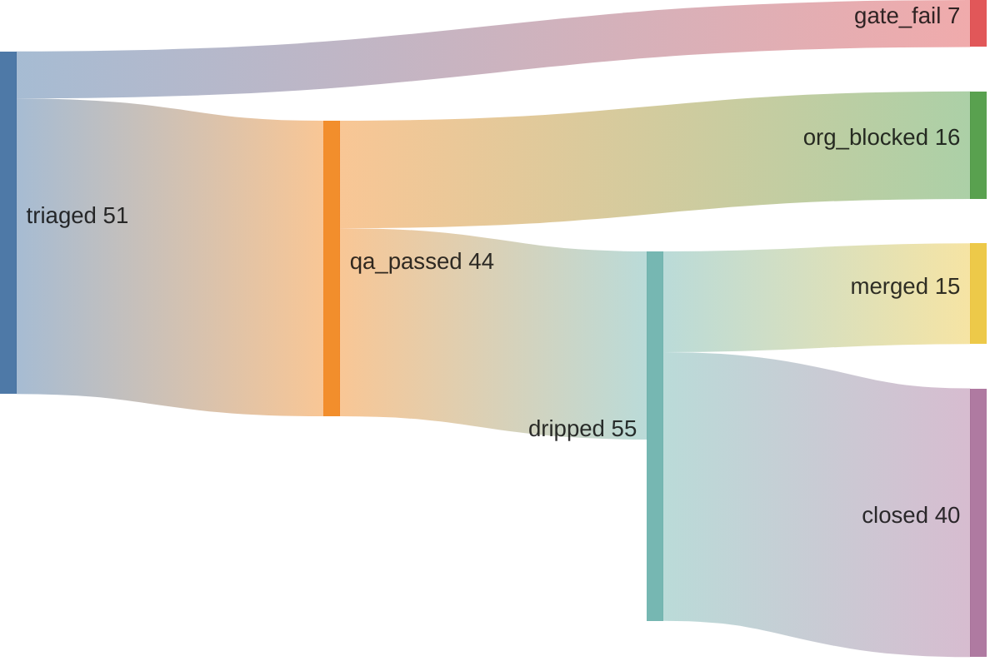

# June Kim

## 15 merged across 15 repos — 27% merge rate (01:13 UTC)



```graphql
{ merged: search(query: "is:pr is:merged author:kimjune01 created:>2026-04-11", type: ISSUE) { issueCount }
  closed: search(query: "is:pr is:closed is:unmerged author:kimjune01 created:>2026-04-11", type: ISSUE) { issueCount } }
```

## Writing

[june.kim](https://june.kim)

## Day job

Research engineer at EA — AI agents that play games on real consoles, detect bugs, report them through an event pipeline.

---

Build in public. AGPL where it matters. Questions? june@june.kim
