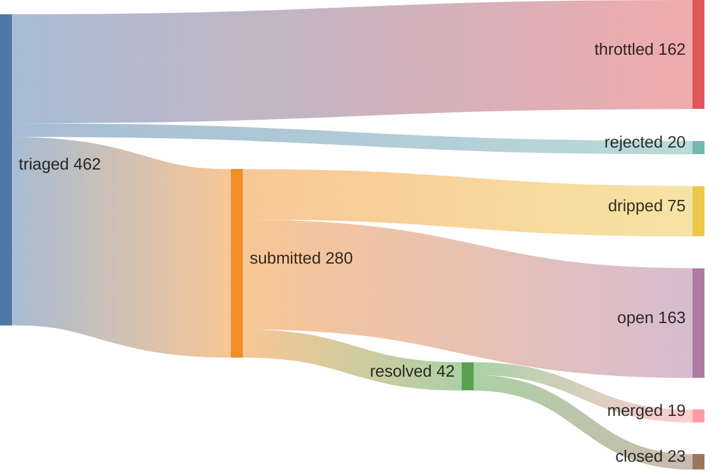
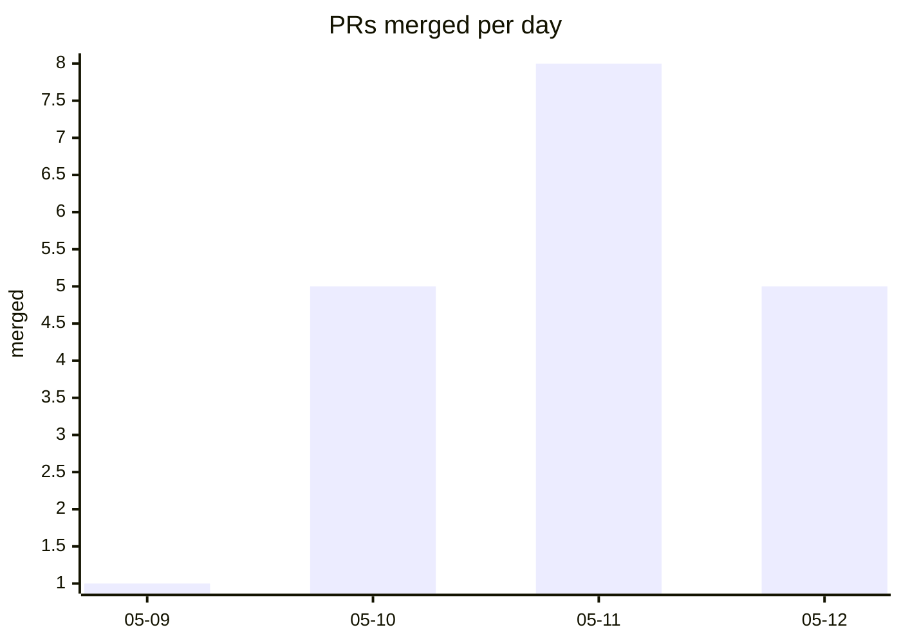

## 45% merge rate · 1 streak (07:13 UTC)





*since 2026-05-09T00:34:00Z (pipeline epoch)*

<details>
<summary>verify</summary>

```graphql
{ merged: search(query: "is:pr is:merged author:kimjune01 created:>2026-05-09T00:34:00Z", type: ISSUE) { issueCount }
  closed: search(query: "is:pr is:closed is:unmerged author:kimjune01 created:>2026-05-09T00:34:00Z", type: ISSUE) { issueCount } }
```

</details>

## Feed

| | repo | PR |
|---|------|----|
| ✅ | IppClub/Dora-SSR | [#97](https://github.com/IppClub/Dora-SSR/pull/97) Fix: remove default always-on-top behavior fo |
| ❌ | risingwavelabs/risingwave | [#25609](https://github.com/risingwavelabs/risingwave/pull/25609) fix: use full column subset for distinct agg  |
| ❌ | kanidm/kanidm | [#4337](https://github.com/kanidm/kanidm/pull/4337) Fix false positive permission warning for cac |
| ❌ | kubescape/kubescape | [#2097](https://github.com/kubescape/kubescape/pull/2097) fix: harden vulnerability manifest URI parsin |
| ✅ | aymericzip/intlayer | [#427](https://github.com/aymericzip/intlayer/pull/427) Fix logo animation positioning for RTL langua |
| ❌ | dhonus/jellyfin-tui | [#193](https://github.com/dhonus/jellyfin-tui/pull/193) fix: reduce CPU usage with frame limiter |
| ✅ | kubescape/kubescape | [#2076](https://github.com/kubescape/kubescape/pull/2076) fix: strip URI prefix before splitting in Rea |
| ✅ | chojs23/concord | [#45](https://github.com/chojs23/concord/pull/45) fix: align cursor position with newline-aware |
| ❌ | immich-app/immich | [#28377](https://github.com/immich-app/immich/pull/28377) fix(web): add focus-visible outlines to sideb |
| ❌ | immich-app/immich | [#28375](https://github.com/immich-app/immich/pull/28375) fix(web): add focus-visible outlines to sideb |

## AI SLOP

| PR | time to close | bugs | title |
|---|---|---|---|
| [uptime-kuma#7371](https://github.com/louislam/uptime-kuma/pull/7371) | <1 min | 0 | 🚨⚠️AI Slop⚠️🚨 cherry-picked |
| [uptime-kuma#7372](https://github.com/louislam/uptime-kuma/pull/7372) | <1 min | 0 | 🚨⚠️AI Slop⚠️🚨 cherry-picked |
| [litestar#4755](https://github.com/litestar-org/litestar/pull/4755) | 7 hrs | 0 | closed per AI policy |
| [ruff#25066](https://github.com/astral-sh/ruff/pull/25066) | 2 days | 0 | mainly produced by AI |
| [llama.cpp#22873](https://github.com/ggml-org/llama.cpp/pull/22873) | 2 days | 1 | AI-generated PR detected |

[hypothesis graph](HYPOTHESIS_GRAPH.md)

---

[june.kim](https://june.kim) · AGPL where it matters
