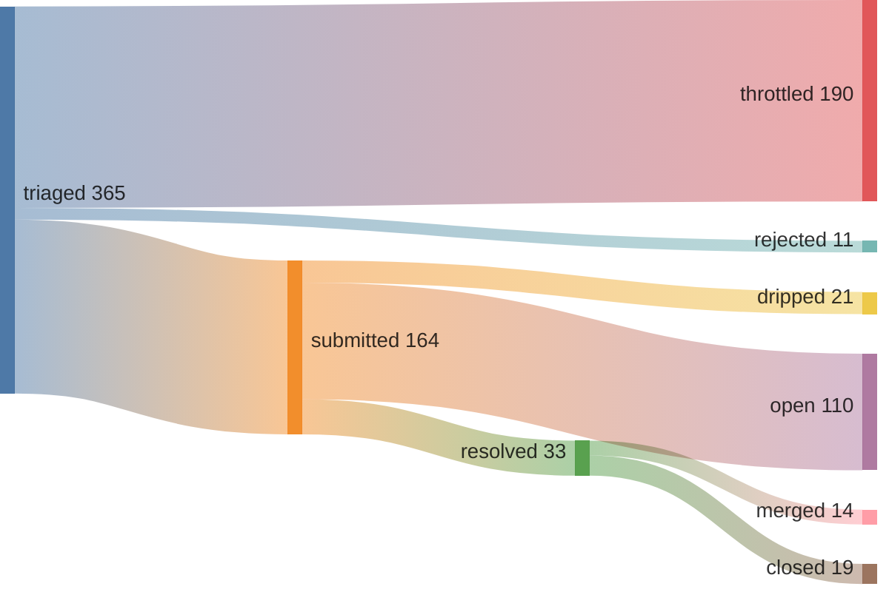

## 42% merge rate · 1 streak (01:43 UTC)



*since 2026-05-08 (pipeline epoch)*

## Feed

- ✅ [jmpsec/osctrl#807](https://github.com/jmpsec/osctrl/pull/807) Fix OSX quick-enroll: stop osqueryd before unload
- ❌ [ggml-org/llama.cpp#22873](https://github.com/ggml-org/llama.cpp/pull/22873) server : fix n_predict=-2 (generate until context full)
- ❌ [dhonus/jellyfin-tui#192](https://github.com/dhonus/jellyfin-tui/pull/192) fix: reduce idle CPU usage with frame rate limiter
- ✅ [scverse/pertpy#965](https://github.com/scverse/pertpy/pull/965) Fix plot_multicomparison_fc ValueError with default figsize
- ✅ [azerty9971/xtend_tuya#930](https://github.com/azerty9971/xtend_tuya/pull/930) Fix battery device class ambiguity for generic sensors
- ❌ [dapr/dapr#9924](https://github.com/dapr/dapr/pull/9924) refactor: simplify workflow concurrency config getters
- ✅ [apache/airflow#66686](https://github.com/apache/airflow/pull/66686) Fix FAB role deletion foreign key constraint violation
- ❌ [astral-sh/ruff#25066](https://github.com/astral-sh/ruff/pull/25066) [flake8-todos] Recognize Jira-style issue IDs on the TODO li
- ✅ [antonmedv/fx#414](https://github.com/antonmedv/fx/pull/414) Fix file argument detection when stdin is /dev/null
- ✅ [GreptimeTeam/greptimedb#8092](https://github.com/GreptimeTeam/greptimedb/pull/8092) fix: remove unparsed [heartbeat] sections from node example 

## 🚨⚠️AI Slop⚠️🚨
- [uptime-kuma#7371](https://github.com/louislam/uptime-kuma/pull/7371)
- [uptime-kuma#7372](https://github.com/louislam/uptime-kuma/pull/7372)
- [ruff#25066](https://github.com/astral-sh/ruff/pull/25066)
- [llama.cpp#22873](https://github.com/ggml-org/llama.cpp/pull/22873)
- [litestar#4755](https://github.com/litestar-org/litestar/pull/4755)

<details>
<summary>verify</summary>

```graphql
{ merged: search(query: "is:pr is:merged author:kimjune01 created:>2026-05-08", type: ISSUE) { issueCount }
  closed: search(query: "is:pr is:closed is:unmerged author:kimjune01 created:>2026-05-08", type: ISSUE) { issueCount } }
```

</details>

## Writing

[june.kim](https://june.kim)

---

Build in public. AGPL where it matters. Questions? june@june.kim
