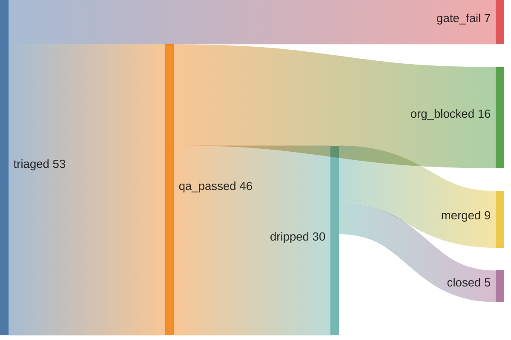

# June Kim

## 9 merged across 9 repos — 64% merge rate · 1 streak (01:17 UTC)



*since 2026-05-09 (pipeline epoch)*

🚨⚠️AI Slop⚠️🚨
- [uptime-kuma#7371](https://github.com/louislam/uptime-kuma/pull/7371)
- [uptime-kuma#7372](https://github.com/louislam/uptime-kuma/pull/7372)
- [ruff#25066](https://github.com/astral-sh/ruff/pull/25066)
- [llama.cpp#22873](https://github.com/ggml-org/llama.cpp/pull/22873)
- [litestar#4755](https://github.com/litestar-org/litestar/pull/4755)

```graphql
{ merged: search(query: "is:pr is:merged author:kimjune01 created:>2026-05-09", type: ISSUE) { issueCount }
  closed: search(query: "is:pr is:closed is:unmerged author:kimjune01 created:>2026-05-09", type: ISSUE) { issueCount } }
```

## Writing

[june.kim](https://june.kim)

## Day job

Research engineer at EA — AI agents that play games on real consoles, detect bugs, report them through an event pipeline.

---

Build in public. AGPL where it matters. Questions? june@june.kim
