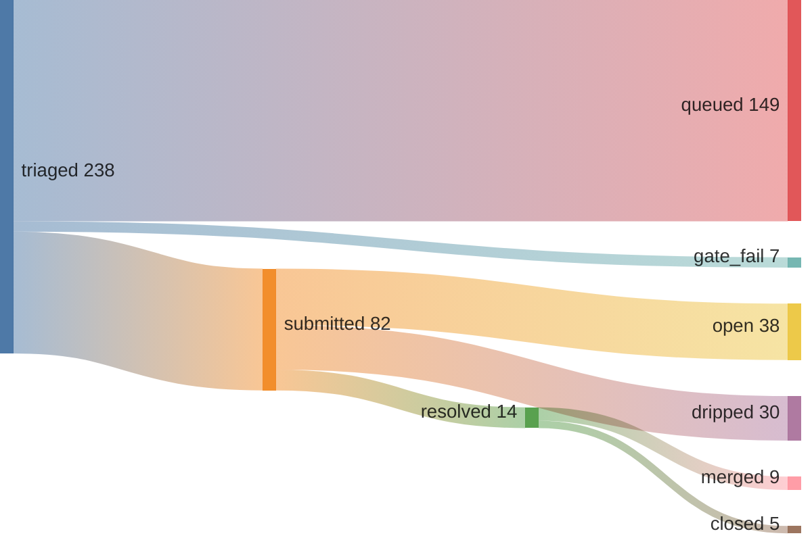

# June Kim

## 9 merged across 9 repos — 64% merge rate · 1 streak (01:20 UTC)



*since 2026-05-09 (pipeline epoch)*

```graphql
{ merged: search(query: "is:pr is:merged author:kimjune01 created:>2026-05-09", type: ISSUE) { issueCount }
  closed: search(query: "is:pr is:closed is:unmerged author:kimjune01 created:>2026-05-09", type: ISSUE) { issueCount } }
```

## Writing

[june.kim](https://june.kim)

## Day job

Research engineer at EA — AI agents that play games on real consoles, detect bugs, report them through an event pipeline.

---

Build in public. AGPL where it matters. Questions? june@june.kim
