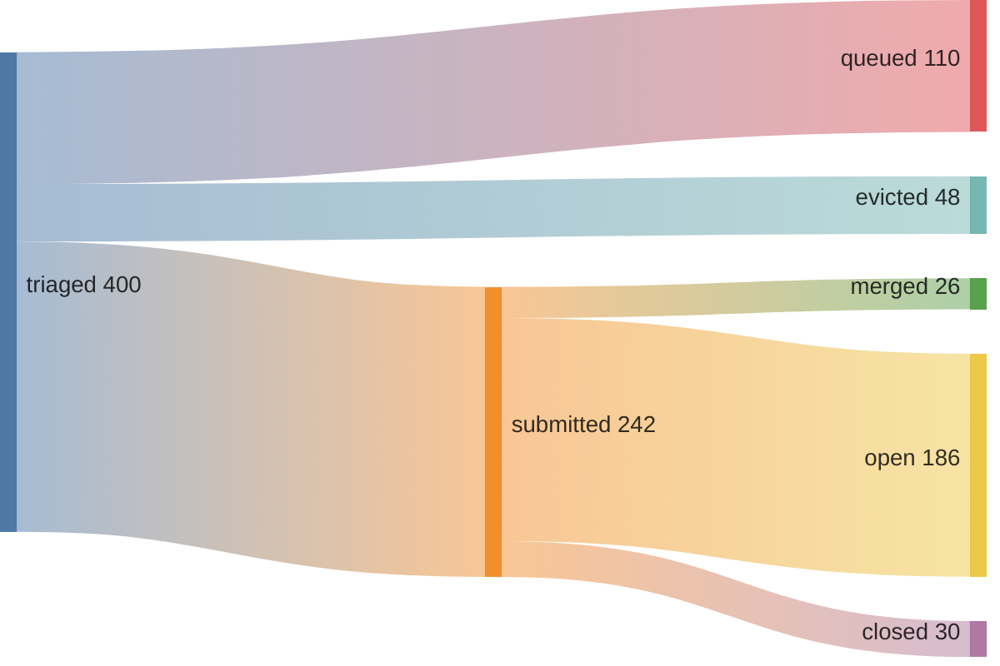
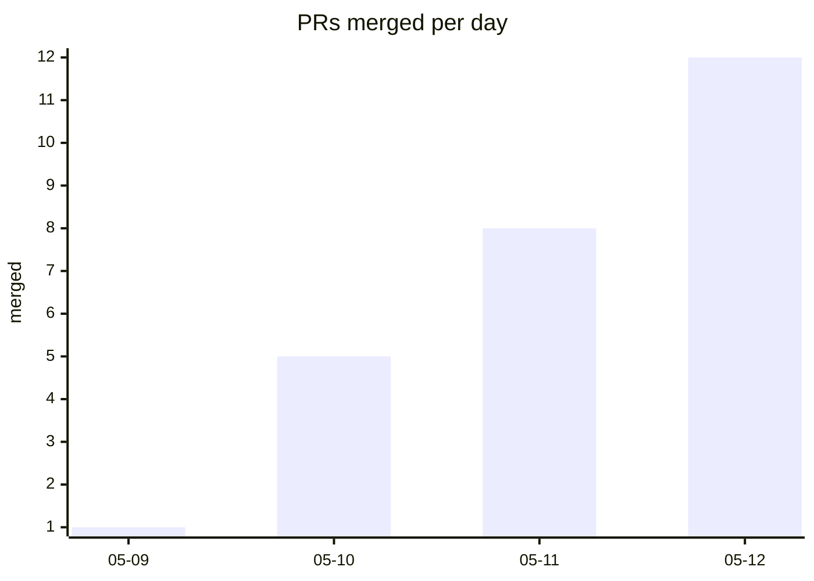

## 45% merge rate · 53 merged · 40 repos · 🔥 streak: 3





*since 2026-05-09T00:34:00Z (pipeline epoch)*

<details>
<summary>verify</summary>

```graphql
{ merged: search(query: "is:pr is:merged author:kimjune01 created:>2026-05-09T00:34:00Z", type: ISSUE) { issueCount }
  closed: search(query: "is:pr is:closed is:unmerged author:kimjune01 created:>2026-05-09T00:34:00Z", type: ISSUE) { issueCount } }
```

</details>

## Feed

| | repo | PR |
|---|------|----|
| ✅ | rustledger/rustledger | [#1095](https://github.com/rustledger/rustledger/pull/1095) fix: add checksum verification and prevent file clobber |
| ✅ | AhoyISki/duat | [#57](https://github.com/AhoyISki/duat/pull/57) Add Ayu theme with dark, light, and mirage variants |
| ✅ | vavallee/bindery | [#592](https://github.com/vavallee/bindery/pull/592) Surface timestamps in download queue UI |
| ❌ | dapr/dapr | [#9936](https://github.com/dapr/dapr/pull/9936) fix: placement dissemination timeout race |
| ✅ | sqlpage/SQLPage | [#1284](https://github.com/sqlpage/SQLPage/pull/1284) Fix DuckDB :: casting warning |
| ❌ | withastro/astro | [#16704](https://github.com/withastro/astro/pull/16704) fix(build): strip client:only imports from prerender graph |
| ✅ | cachix/secretspec | [#88](https://github.com/cachix/secretspec/pull/88) fix(test): use portable command for empty-output test |
| ✅ | tach-org/tach | [#931](https://github.com/tach-org/tach/pull/931) fix: report syntax errors as errors, not warnings |
| ✅ | njbrake/agent-of-empires | [#1042](https://github.com/njbrake/agent-of-empires/pull/1042) refactor: remove dead claude.config_dir config field |
| ❌ | openbao/openbao | [#3067](https://github.com/openbao/openbao/pull/3067) fix: apply socket_mode without requiring socket_user/socket_group |

## Leaderboard

*voluntary contributions to repos you don't own | non-owner only | [methodology](https://github.com/kimjune01/kimjune01)*

| contributor | merged | rate | repos |
|---|---|---|---|
| SAY-5 | 59 | 67% | 54 |
| kimjune01 | 53 | 45% | 40 |
| mvanhorn | 14 | 82% | 12 |
| ununununium | 12 | 70% | 10 |
| officialasishkumar | 5 | 71% | 4 |

[Join the leaderboard](https://github.com/kimjune01/sweep/blob/master/README.md) · [Protect your repo](https://github.com/kimjune01/sweep/blob/master/action.yml)

## AI SLOP

| PR | time to close | bugs | reason |
|---|---|---|---|
| [uptime-kuma#7371](https://github.com/louislam/uptime-kuma/pull/7371) | <1 min | 0 | cherry-picked |
| [uptime-kuma#7372](https://github.com/louislam/uptime-kuma/pull/7372) | <1 min | 0 | cherry-picked |
| [jellyfin-tui#194](https://github.com/dhonus/jellyfin-tui/pull/194) | 5 min | 0 | ai slop |
| [litestar#4755](https://github.com/litestar-org/litestar/pull/4755) | 7 hrs | 0 | closed per AI policy |
| [gherkin#589](https://github.com/cucumber/gherkin/pull/589) | 3 hrs | 0 | no human in the loop |
| [ruff#25066](https://github.com/astral-sh/ruff/pull/25066) | 2 days | 0 | mainly produced by AI |
| [llama.cpp#22873](https://github.com/ggml-org/llama.cpp/pull/22873) | 2 days | 1 | AI-generated PR detected |

[hypothesis graph](HYPOTHESIS_GRAPH.md)

---

[june.kim](https://june.kim) · AGPL where it matters
