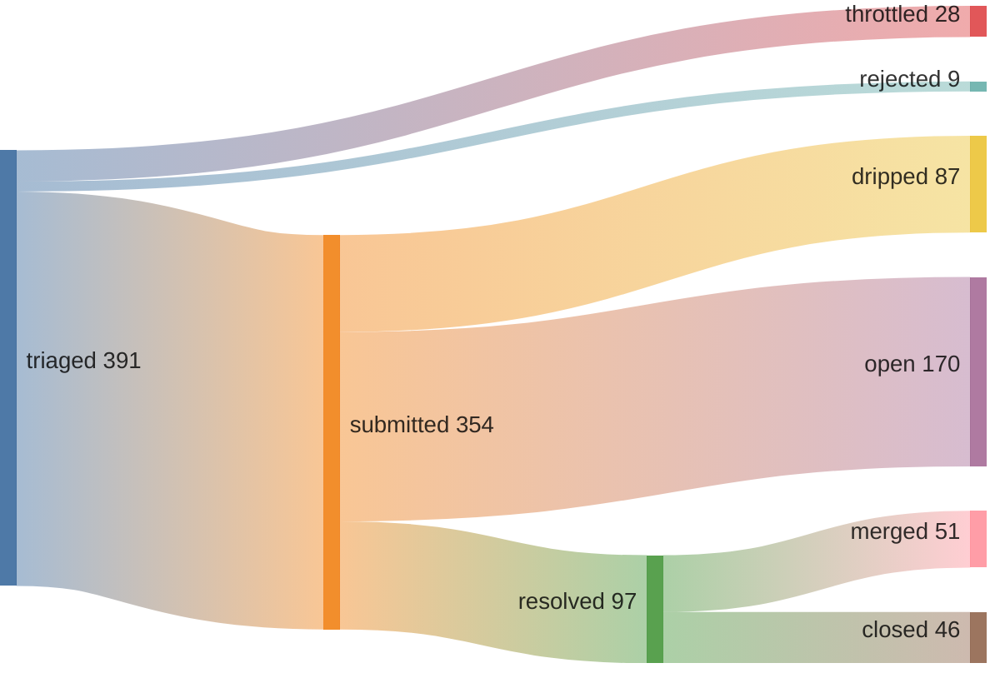

## 52% merge rate · 0 streak (16:52 UTC)

[Speedrunning Open Source](https://june.kim/speedrunning-open-source) · [why the loop works](https://june.kim/does-iteration-mitigate-slop-slope) (mechanism explainer; data is in the verify block below)

```mermaid
xychart-beta
    title "PRs merged + defenses dispensed per day"
    x-axis ["05-09", "05-10", "05-11", "05-12", "05-13"]
    y-axis "count"
    bar [1, 5, 8, 23, 14]
    bar [0, 0, 0, 9, 8]
```





*since 2026-05-09T00:34:00Z (pipeline epoch)*

<details>
<summary>verify</summary>

```graphql
{ merged: search(query: "is:pr is:merged author:kimjune01 created:>2026-05-09T00:34:00Z", type: ISSUE) { issueCount }
  closed: search(query: "is:pr is:closed is:unmerged author:kimjune01 created:>2026-05-09T00:34:00Z", type: ISSUE) { issueCount } }
```

</details>

## Issues generated

**70% positive reception** · [hypothesis graph](ISSUE_HYPOTHESIS_GRAPH.md)

58 issues filed since 2026-05-12 (slop-filter campaign start) · 17 positive · 7 negative · 11 bot-closed (already protected) · 23 inconclusive


*positive = closed-as-completed, accepted/bug-labeled, or open with maintainer engagement. negative = maintainer rejected (closed-as-not-planned with engagement), or silent treatment (open with no engagement after 7-day grace — wrong target). bot-closed = closed by a bot account, spam-labeled, or stale-bot patterns — these repos already have automated handling, so the offer is redundant. inconclusive = open without engagement within 7-day grace, or closed as duplicate. rate = positive ÷ (positive + negative).*

<details>
<summary>verify</summary>

```bash
~/.sweep/bin/scoreboard --since 2026-05-12
```

</details>

## Feed

| | repo | PR |
|---|------|----|
| ❌ | pvolok/mprocs | [#218](https://github.com/pvolok/mprocs/pull/218) Show autostart:false procs in gray instead of |
| ❌ | pvolok/mprocs | [#217](https://github.com/pvolok/mprocs/pull/217) docs: document command menu (p key) |
| ✅ | slatedb/slatedb | [#1654](https://github.com/slatedb/slatedb/pull/1654) Fix DbReaderBuilder bypassing DbCacheWrapper  |
| ✅ | pingcap/tidb | [#68318](https://github.com/pingcap/tidb/pull/68318) expression: guard LPAD/RPAD against integer o |
| ✅ | jmhodges/howsmyssl | [#1005](https://github.com/jmhodges/howsmyssl/pull/1005) Fix JSON redirect to respect Accept header |
| ✅ | apache/opendal | [#7513](https://github.com/apache/opendal/pull/7513) feat(core): add split_to and split_off to Buf |
| ✅ | mattgodbolt/jsbeeb | [#696](https://github.com/mattgodbolt/jsbeeb/pull/696) fix: use clientX/Y for mouse coordinates |
| ✅ | flux-rs/flux | [#1592](https://github.com/flux-rs/flux/pull/1592) Use compact formatting for fixpoint binary co |
| ❌ | fish-shell/fish-shell | [#12754](https://github.com/fish-shell/fish-shell/pull/12754) fish_git_prompt: fix rename miscount in infor |
| ✅ | dyc3/opentogethertube | [#2017](https://github.com/dyc3/opentogethertube/pull/2017) fix: reject newlines in room title |

## Leaderboard

*since 2026-05-09 (pipeline epoch) | voluntary contributions to repos you don't own | non-owner only | [methodology](https://github.com/kimjune01/kimjune01)*

| contributor | merged | rate | repos |
|---|---|---|---|
| SAY-5 | 101 | 67% | 93 |
| kimjune01 | 42 | 58% | 39 |
| mvanhorn | 28 | 84% | 22 |
| yakushabb | 17 | 73% | 17 |
| officialasishkumar | 15 | 88% | 12 |
| ununununium | 14 | 70% | 11 |
| fdelbrayelle | 7 | 87% | 4 |
| GeertvanHorrik | 2 | 66% | 1 |

[Join the leaderboard](https://github.com/kimjune01/sweep/blob/master/README.md) · [Protect your repo](https://github.com/kimjune01/sweep/blob/master/action.yml)

## AI SLOP

| PR | time to close | bugs | title |
|---|---|---|---|
| [uptime-kuma#7371](https://github.com/louislam/uptime-kuma/pull/7371) | <1 min | 0 | 🚨⚠️AI Slop⚠️🚨 cherry-picked |
| [uptime-kuma#7372](https://github.com/louislam/uptime-kuma/pull/7372) | <1 min | 0 | 🚨⚠️AI Slop⚠️🚨 cherry-picked |
| [litestar#4755](https://github.com/litestar-org/litestar/pull/4755) | 7 hrs | 0 | closed per AI policy |
| [ruff#25066](https://github.com/astral-sh/ruff/pull/25066) | 2 days | 0 | mainly produced by AI |
| [llama.cpp#22873](https://github.com/ggml-org/llama.cpp/pull/22873) | 2 days | 1 | AI-generated PR detected |

[hypothesis graph](HYPOTHESIS_GRAPH.md)

---

[june.kim](https://june.kim) · AGPL where it matters
