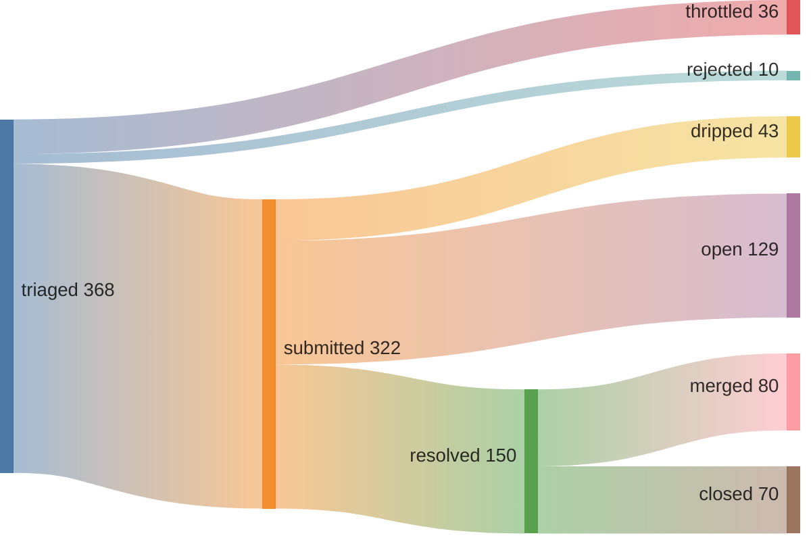

# June Kim

*Evaluation engineer.* I audit frontier coding benchmarks for construct validity, find where the headline metric measures something other than what it claims, and ship the receipts as preregistered, re-runnable artifacts. When I need to read a benchmark's test suite, I read it in whatever stack it ships.

[](https://june.kim)
[](https://june.kim/resume)
[](https://june.kim)


> The last three months, in one line: I ran independent audits on the benchmarks the field quotes, proved parts of an auction mechanism in Lean, and shipped 49 merged PRs into repos I don't own. Everything below links to a receipt.

<sub>Expand a section to read the work. Every claim has a repo, a DOI, or a re-runnable command behind it.</sub>

---

<details open>
<summary>🔬 Benchmark construct-validity audits — the field's scoreboards, re-graded</summary>

<br>

A passing grade is a claim. I check whether the harness measures what the paper says it measures. Each audit is model-blind where it can be, preregistered, and archived so anyone can re-grade it from a committed diff.

| benchmark | what I found | receipt |
|---|---|---|
| SWE-bench Pro — determinacy audit *(flagship)* | Proven 15% underdetermined floor; 3 gold patches fail the benchmark's *own* verifier. Audited all 728 tasks, filed with maintainers. | [swebench-pro-audit](https://github.com/kimjune01/swebench-pro-audit) · [determinacy](https://github.com/kimjune01/determinacy) |
| SWE-bench Pro — harness run | 95.3% (694/728) under the official grader, preregistered and frozen, every verdict re-gradable. Solo, on a $200/mo plan. | [swebench-pro](https://github.com/kimjune01/swebench-pro) |
| ProgramBench | The "% Resolved" metric scores recall of published algorithms, not source-blind reconstruction. 21+ programs gated on recalling a hash, cipher, or codec. | [program-bench-audit](https://github.com/kimjune01/program-bench-audit) |
| DeepSWE | Applied each reference solution to its own verifier: 4 of 113 fail. Under $1, under an hour, two-pass preregistered protocol. | [deepswe-run](https://github.com/kimjune01/deepswe-run) |
| SWE-rebench | Determinacy audit: 14.5% pointer-checkable claimable spine (7 airtight + 9 codebase-plural). | [swe-rebench-audit](https://github.com/kimjune01/swe-rebench-audit) |
| Terminal-Bench 2.1 | Frame-validity audit: does a passing grade forgive unwarranted destruction? | [terminal-bench-audit](https://github.com/kimjune01/terminal-bench-audit) |

The tool behind them: [`determinacy`](https://github.com/kimjune01/determinacy), grep-certified receipts for tasks where the hidden test grades what the spec never stated. Reusable across any SWE-bench-shaped benchmark.

</details>

<details>
<summary>📐 Formal verification & soundness gates</summary>

<br>

| project | what it is | receipt |
|---|---|---|
| auction-proof | Lean 4 proofs for VCG auction properties. Companion to the DOI-archived preprint *Formally Verified VCG Mechanisms*. | [auction-proof](https://github.com/kimjune01/auction-proof) |
| enzyme-soundness-gate | A proof-by-cases soundness gate that reproduced two Enzyme-JAX compiler bugs from structure alone (filed upstream: EnzymeAD/Enzyme-JAX #2570, #2571). Two autodiff fixes landed separately. | [enzyme-soundness-gate](https://github.com/kimjune01/enzyme-soundness-gate) |
| flux | Contributions to refinement types for Rust. | [flux-rs/flux](https://github.com/flux-rs/flux) |

</details>

<details>
<summary>🚀 Open-source speedrun — 49 merged into repos I don't own</summary>

<br>

53% merge rate across 46 external repos since the pipeline epoch (2026-05-09). Voluntary, non-owner contributions only. [Speedrunning Open Source](https://june.kim/speedrunning-open-source).




[Why the closed PRs closed](CLOSE_REASONS.md) — most "closed" are self-withdrawals, no-AI-policy, duplicates, or bot closes; ~8 are maintainer merit-rejections. Receipts: [`pr-receipts.jsonl`](pr-receipts.jsonl) · [`closed-pr-reasons.jsonl`](closed-pr-reasons.jsonl).

Leaderboard *(non-owner contributions since 2026-05-09)*

| contributor | merged | rate | repos | median diff |
|---|---|---|---|---|
| SAY-5 | 127 | 70% | 48+ | 29 |
| kimjune01 | 49 | 60% | 46 | 41 |
| mvanhorn | 33 | 84% | 26 | 54 |
| yakushabb | 24 | 80% | 23 | 10 |
| ununununium | 15 | 71% | 12 | 1 |

Representative merges: `hyperium/hyper`, `FyroxEngine/Fyrox`, `prowler-cloud/prowler`, `luminal-ai/luminal`, `ag2ai/ag2`, `cackle-rs/cackle`. [Join the leaderboard](https://github.com/kimjune01/sweep/blob/master/README.md) · [Protect your repo](https://github.com/kimjune01/sweep/blob/master/action.yml).

<details>
<summary>verify (GraphQL)</summary>

```graphql
{ merged: search(query: "is:pr is:merged author:kimjune01 created:>2026-05-09T00:34:00Z", type: ISSUE) { issueCount }
  closed: search(query: "is:pr is:closed is:unmerged author:kimjune01 created:>2026-05-09T00:34:00Z", type: ISSUE) { issueCount } }
```

</details>

</details>

<details>
<summary>🎲 Anytime-valid statistics & e-values — evidence as a running bet</summary>

<br>

| project | what it is | receipt |
|---|---|---|
| methodeutics | E-value bankrolls: anytime-valid evidence as a running bet against your hypothesis. Now also a textbook. | [methodeutics](https://github.com/kimjune01/methodeutics) |
| return-to-sender | Nodewise e-values under graph interference: synthetic validation of an abuse filter. | [return-to-sender](https://github.com/kimjune01/return-to-sender) |
| hygraph-mechanism | A hypothesis-graph A/B with replayable receipts. *Silicon in verba*: take nobody's word for it, not even the machine's. | [hygraph-mechanism](https://github.com/kimjune01/hygraph-mechanism) |

Published (DOI-archived preprints, full record at [june.kim](https://june.kim)): *The Hypothesis Graph* · *Verifiable Knowledge* · *What Cannot Be False Cannot Be True*.

</details>

<details>
<summary>🧩 Agent & context infrastructure</summary>

<br>

| project | what it is | receipt |
|---|---|---|
| union-find-compaction | Context compaction for chatbots that tracks cluster provenance, enabling consolidation instead of summarization. [Ported to gemini-cli](https://github.com/kimjune01/union-find-compaction-for-gemini-cli). | [union-find-compaction](https://github.com/kimjune01/union-find-compaction) |
| cord | A coordination protocol for trees of Claude Code agents. | [cord](https://github.com/kimjune01/cord) |
| arc-agi-3 | An agent that learns game rules by acting, no priors injected. | [arc-agi-3](https://github.com/kimjune01/arc-agi-3) |
| abductor | Execution-gated abductive evaluation for LLM-driven program repair. | [abductor](https://github.com/kimjune01/abductor) |
| generative-tau-bench | Seeded replay-oracle extension of tau-bench for contamination-resistant, statistically honest tool-agent evaluation. | [generative-tau-bench](https://github.com/kimjune01/generative-tau-bench) |

</details>

<details>
<summary>🛠️ Tools · 📜 Writing</summary>

<br>

- [linkedin-slop-filter](https://github.com/kimjune01/linkedin-slop-filter) — Chrome extension that hides low-effort AI slop, using Chrome's built-in on-device model. 100% local.
- [peirce](https://github.com/kimjune01/peirce) — transcriptions of the public-domain works of Charles Sanders Peirce (CC BY-SA 4.0).
- [june.kim](https://github.com/kimjune01/june.kim) — the blog, where the methodology lives in public: preregistration checklists, a published null result, and a post-mortem of a $1,000 held-out-test-leakage mistake.

</details>

---

<sub>10+ years shipping software at Google/YouTube, Loom, and startups before this. Full history: [resume](https://june.kim/resume) · [june.kim](https://june.kim).</sub>
