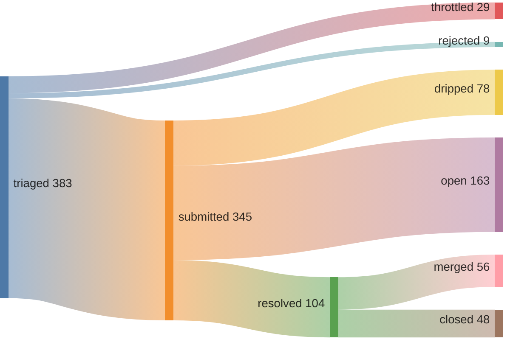

## 53% merge rate · 0 streak (22:49 UTC)

[Speedrunning Open Source](https://june.kim/speedrunning-open-source) · [why the loop works](https://june.kim/does-iteration-mitigate-slop-slope) (mechanism explainer; data is in the verify block below)

```mermaid
xychart-beta
    title "PRs merged + defenses dispensed per day"
    x-axis ["05-09", "05-10", "05-11", "05-12", "05-13"]
    y-axis "count"
    bar [1, 5, 8, 23, 19]
    bar [0, 0, 0, 9, 9]
```





*since 2026-05-09T00:34:00Z (pipeline epoch)*

<details>
<summary>verify</summary>

```graphql
{ merged: search(query: "is:pr is:merged author:kimjune01 created:>2026-05-09T00:34:00Z", type: ISSUE) { issueCount }
  closed: search(query: "is:pr is:closed is:unmerged author:kimjune01 created:>2026-05-09T00:34:00Z", type: ISSUE) { issueCount } }
```

</details>

## Issues generated

**72% positive reception** · [hypothesis graph](ISSUE_HYPOTHESIS_GRAPH.md)

58 issues filed since 2026-05-12 (slop-filter campaign start) · 18 positive · 7 negative · 11 bot-closed (already protected) · 22 inconclusive


*positive = closed-as-completed, accepted/bug-labeled, or open with maintainer engagement. negative = maintainer rejected (closed-as-not-planned with engagement), or silent treatment (open with no engagement after 7-day grace — wrong target). bot-closed = closed by a bot account, spam-labeled, or stale-bot patterns — these repos already have automated handling, so the offer is redundant. inconclusive = open without engagement within 7-day grace, or closed as duplicate. rate = positive ÷ (positive + negative).*

<details>
<summary>verify</summary>

```bash
~/.sweep/bin/scoreboard --since 2026-05-12
```

</details>

## Feed

| | repo | PR |
|---|------|----|
| ❌ | Jaxx497/NoctaVox | [#21](https://github.com/Jaxx497/NoctaVox/pull/21) fix: provide actionable error messages for da |
| ✅ | ag2ai/ag2 | [#2805](https://github.com/ag2ai/ag2/pull/2805) fix: initialize task variable in RemoteAgent  |
| ✅ | hyperium/hyper | [#4065](https://github.com/hyperium/hyper/pull/4065) docs(error): add detailed doc comments to Err |
| ✅ | luminal-ai/luminal | [#312](https://github.com/luminal-ai/luminal/pull/312) feat: add CUDA 13.2 support via cudarc 0.19.4 |
| ❌ | boldsoftware/shelley | [#208](https://github.com/boldsoftware/shelley/pull/208) docs: document bang (!) command for shell acc |
| ✅ | open-telemetry/opentelemetry-collector | [#15281](https://github.com/open-telemetry/opentelemetry-collector/pull/15281) Add testable examples for consumer package |
| ✅ | MCPJam/inspector | [#2093](https://github.com/MCPJam/inspector/pull/2093) fix(docs): use latest release URLs for deskto |
| ❌ | pvolok/mprocs | [#218](https://github.com/pvolok/mprocs/pull/218) Show autostart:false procs in gray instead of |
| ❌ | pvolok/mprocs | [#217](https://github.com/pvolok/mprocs/pull/217) docs: document command menu (p key) |
| ✅ | slatedb/slatedb | [#1654](https://github.com/slatedb/slatedb/pull/1654) Fix DbReaderBuilder bypassing DbCacheWrapper  |

## Leaderboard

*since 2026-05-09 (pipeline epoch) | voluntary contributions to repos you don't own | non-owner only | [methodology](https://github.com/kimjune01/kimjune01)*

| contributor | merged | rate | repos |
|---|---|---|---|
| SAY-5 | 112 | 67% | 93 |
| kimjune01 | 45 | 58% | 42 |
| mvanhorn | 31 | 86% | 24 |
| yakushabb | 23 | 79% | 22 |
| officialasishkumar | 15 | 88% | 12 |
| ununununium | 14 | 70% | 11 |
| fdelbrayelle | 7 | 87% | 4 |
| GeertvanHorrik | 2 | 66% | 1 |
| tuanaiseo | 1 | 33% | 1 |

[Join the leaderboard](https://github.com/kimjune01/sweep/blob/master/README.md) · [Protect your repo](https://github.com/kimjune01/sweep/blob/master/action.yml)

## AI SLOP

| PR | time to close | bugs | title |
|---|---|---|---|
| [uptime-kuma#7371](https://github.com/louislam/uptime-kuma/pull/7371) | <1 min | 0 | 🚨⚠️AI Slop⚠️🚨 cherry-picked |
| [uptime-kuma#7372](https://github.com/louislam/uptime-kuma/pull/7372) | <1 min | 0 | 🚨⚠️AI Slop⚠️🚨 cherry-picked |
| [litestar#4755](https://github.com/litestar-org/litestar/pull/4755) | 7 hrs | 0 | closed per AI policy |
| [ruff#25066](https://github.com/astral-sh/ruff/pull/25066) | 2 days | 0 | mainly produced by AI |
| [llama.cpp#22873](https://github.com/ggml-org/llama.cpp/pull/22873) | 2 days | 1 | AI-generated PR detected |

[hypothesis graph](HYPOTHESIS_GRAPH.md)

---

[june.kim](https://june.kim) · AGPL where it matters
